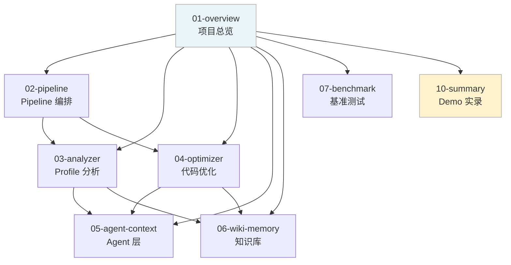
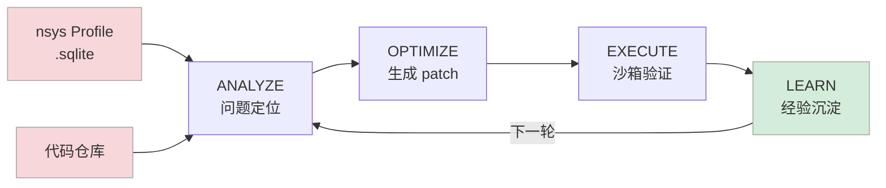

# Sysight — AI 驱动的 GPU 训练性能自动优化

**一句话**：给一份 nsys profile，给一个代码仓库，Sysight 自动找问题、定位源码、生成 patch、验证效果，全程不需要人工介入。

在 nanoGPT 的 Shakespeare 字符级训练任务上，Sysight 完整跑通了这条链路：从 nsys profile 分析出三处 CPU 端瓶颈（memmap 重载、pos tensor 重建、逐样本转换），生成 4 个 patch，实测迭代时间从 **14.12ms 降到 12.96ms，提升 8.2%**。详见 [10-summary.md](./10-summary.md)。

---

## 文档结构

```
docs/
├── 01-overview.md          ← 本文（项目简介 + 文档导航）
├── 02-pipeline.md          ← Pipeline 设计：5 个阶段的编排逻辑与数据流
├── 03-analyzer.md          ← Analyzer：Profile 分析引擎 + Scanner 源码扫描
├── 04-optimizer.md         ← Optimizer：代码生成、沙箱验证与 Patch 应用
├── 05-agent-context.md     ← Agent 层：AgentLoop 与渐进式上下文压缩
├── 06-wiki-memory.md       ← 知识库：Wiki 存储设计与 LEARN 阶段
├── 07-benchmark.md         ← 基准测试：Analyze Bench + Optimize Bench
└── 10-summary.md           ← Demo 全记录：nanoGPT 优化两轮 Pipeline 实录
```



---

## Sysight 是什么

性能优化有个隐藏成本：profiling 工具和代码之间的跳转。工程师要在 "看 profile → 找代码 → 判断真假 → 写 patch → 验证" 这个循环里反复切换上下文，每步都很费时间。

Sysight 把这个循环自动化了。核心链路：



关键设计决策：**Pipeline 硬编码，LLM 只在它擅长的地方工作**。阶段顺序是固定的，LLM 不负责编排；"改代码、跑代码、量时间"这些确定性操作全由代码侧执行，不信任 LLM 的自我评估。

---

## 能做什么

| 能力 | 说明 |
|------|------|
| **Profile 分析** | 自动查询 nsys SQLite，发现 C1–C7 七类性能问题，输出带文件行号的 finding |
| **源码定位** | 每个 finding 精确到 文件:函数:行号，附带 profile 证据链 |
| **自动修复** | LLM 评判 finding 真伪，对确认问题生成最小化 patch |
| **沙箱验证** | 在独立 git worktree 里 apply patch → smoke test → 测量 → 接受或回滚 |
| **知识积累** | 每轮结果写入 wiki，下一轮自动参考，不重复踩坑 |
| **基准评估** | 6 个分析 case + 6 个优化 case，量化分析和优化能力 |

---

## 七类性能问题（C1–C7）

Sysight 的分析覆盖 GPU 程序的全部主要性能维度：

| 类别 | 名称 | 典型场景 |
|------|------|---------|
| **C1** | Host Scheduling | DataLoader `num_workers=0`、`pin_memory=False` |
| **C2** | Kernel Launch Overhead | Python 循环触发大量小 CUDA kernel |
| **C3** | Synchronization | `.item()`、`.cpu()`、`cudaDeviceSynchronize()` 阻塞 |
| **C4** | Memory Copy | 热路径中的 `.to(device)`、不必要的 H2D/D2H |
| **C5** | Compute Inefficiency | 重复计算、可消除的 clone/cat/contiguous |
| **C6** | Communication | all_reduce/all_gather 配置不当，DDP/FSDP overlap 不足 |
| **C7** | Python Pipeline | DataLoader 内逐 sample 循环、json 序列化 |

---

## 基准测试结果（SOTA）

### 分析能力

| Case | 场景 | 满分 | 最高得分 | 准确率 |
|------|------|:----:|:--------:|:------:|
| case_1 | 单卡训练（DataLoader + 同步 + 计算浪费） | 16 | 15 | 94% |
| case_2 | 多卡 DDP（通信 + 同步 + 配置） | 17 | 17 | 100% |
| case_3 | 推理服务（KV cache + batching） | 17 | 12 | 71% |
| case_4 | 混合精度训练（AMP + checkpoint） | 16 | 9 | 56% |
| case_5 | Pipeline 并行（micro-batch + 调度） | 17 | 17 | 100% |
| case_6 | 多模态训练（vision + text + fusion） | 17 | 15 | 88% |

### 优化能力（Optimize Benchmark 评分维度）

| 维度 | 权重 | 含义 |
|------|:----:|------|
| Correctness | 40 | patch apply 成功 + smoke test 通过 |
| Performance | 30 | timer delta < −5% 满分，< 0 半分 |
| Judgment | 20 | 正确接受真 finding、拒绝假 finding（F1） |
| Minimality | 10 | patch 行数在合理范围内 |

---

## 与同类工具的区别

| | Sysight | nsys CLI | 人工分析 | 通用 Coding Agent |
|---|:---:|:---:|:---:|:---:|
| 读懂 nsys profile | ✅ 自动 | ✅ 原始数据 | ✅ 需要经验 | ❌ |
| 定位源码行号 | ✅ 精确 | ❌ | ✅ 手动 | ⚠️ 不准 |
| 生成可执行 patch | ✅ | ❌ | ✅ 手动 | ⚠️ 不保证 |
| 验证修复效果 | ✅ 实测对比 | ❌ | ✅ 手动 | ❌ |
| 知识积累 | ✅ wiki | ❌ | ⚠️ 靠记忆 | ❌ |
| GPU 领域知识 | ✅ C1–C7 体系 | ❌ | ✅ 需经验 | ❌ |

Sysight 不是通用 coding agent——它只做 GPU 性能优化这一件事，但把这件事做到端到端自动化。

---

## 参考项目

- [nsys-ai](https://github.com/GindaChen/nsys-ai) — nsys SQLite 分析思路
- [karpathy/autoresearch](https://github.com/karpathy/autoresearch) — 自我迭代的 agent 研究范式
- [PolyArch/humanize](https://github.com/PolyArch/humanize) — agentic coding harness 设计
- [obra/superpowers](https://github.com/obra/superpowers) — agentic skills 框架
- [code-review-graph](https://github.com/tirth8205/code-review-graph) — 代码扫描与图结构设计

---

## 快速开始

```bash
# 安装
git clone <repo-url> && cd Sysight
pip install -e .

# 配置 LLM（.sysight/config.yaml）
analyze:
  provider: openai_compatible
  api_key: "your-key"
  model: "gpt-5"

# 一键全流程
sysight agent-loop --repo ./my-training-repo --profile profiles/trace.sqlite

# 或分步运行
sysight warmup ./my-training-repo
sysight analyze profiles/trace.sqlite --repo ./my-training-repo
sysight optimize <run_id> --repo ./my-training-repo
```

各阶段详细用法见 [02-pipeline.md](./02-pipeline.md)。
