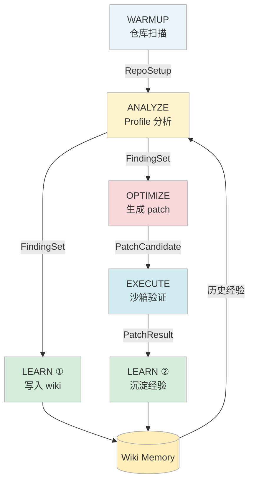
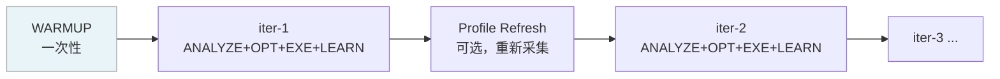

# Pipeline 设计

Sysight 的核心是一条 **5 阶段硬编码 Pipeline**。阶段顺序固定，LLM 只在它擅长的地方（分析、生成、归纳）工作，确定性操作（扫描、apply、测量）全由代码执行。

---

## 目录

- [整体数据流](#整体数据流)
- [WARMUP — 仓库预热](#warmup--仓库预热)
- [ANALYZE — 性能分析](#analyze--性能分析)
- [OPTIMIZE — 代码生成](#optimize--代码生成)
- [EXECUTE — 沙箱验证](#execute--沙箱验证)
- [LEARN — 知识积累](#learn--知识积累)
- [AgentLoop 迭代](#agentloop-迭代)
- [阶段间通信设计](#阶段间通信设计)

---

## 整体数据流

```
┌─────────────┐
│   WARMUP    │  → RepoSetup（入口、热路径、配置）        [确定性，不调 LLM]
└──────┬──────┘
       │ RepoSetup
       ▼
┌─────────────┐
│   ANALYZE   │  → LocalizedFindingSet（文件:函数:行号）  [LLM + 工具调用]
└──────┬──────┘
       │ findings_json
       ▼
┌─────────────┐
│    LEARN①   │  → wiki 更新（finding 模式）              [LLM]
└──────┬──────┘
       │ findings_json
       ▼
┌─────────────┐
│  OPTIMIZE   │  → PatchCandidate[]（代码替换计划）        [LLM + 工具调用]
└──────┬──────┘
       │ patches + findings
       ▼
┌─────────────┐
│   EXECUTE   │  → PatchResult[]（apply + 测量结果）       [确定性，不调 LLM]
└──────┬──────┘
       │ patches + timer 结果
       ▼
┌─────────────┐
│    LEARN②   │  → wiki 更新（优化经验）                  [LLM]
└─────────────┘
```



---

## WARMUP — 仓库预热

**类型**：确定性，不调用 LLM。

WARMUP 是一个纯工程阶段：找入口文件、解析配置、追踪 import 链、构建调用图。这些事情不需要推理，LLM 做反而又慢又贵又不准。

### 流程

```
1. 发现入口命令
   ├── 扫描 run.sh / Makefile / README 中的 python/torchrun 命令
   ├── 解析命令行参数，提取 --config 指向的配置文件
   └── 验证命令可执行（dry-run）

2. 构建文件索引
   ├── 扫描所有 .py 文件
   ├── 排除依赖噪声（.venv, site-packages, __pycache__）
   └── 按目录结构组织索引

3. 追踪调用关系
   ├── AST 解析 import 关系
   ├── 从入口文件出发追踪 import 链
   └── 标记"热路径"（入口直接或间接引用的文件）

4. 生成并写入 overview
   └── .sysight/memory/wiki/workspaces/<namespace>/overview.md
```

### 输出

```python
@dataclass
class RepoSetup:
    entry_point: str          # "python run.py --config configs/train.yaml"
    active_config: str        # "configs/train.yaml"
    hot_paths: list[str]      # ["src/train.py", "src/model.py", ...]
    test_commands: list       # 用于 smoke test
    env_vars: dict
    source: str               # "warmup_verified" | "warmup_partial"
```

WARMUP 结果以 repo 路径 hash 为 key 缓存到 `.sysight/warmup-caches/`，重复运行默认读缓存。

---

## ANALYZE — 性能分析

**类型**：LLM + 工具调用（AgentLoop）。

这是 Sysight 最核心的阶段。LLM 需要读懂 nsys SQLite 数据、形成 C1–C7 假设、阅读源码验证、精确定位行号。这些步骤需要推理能力，正是 LLM 的强项。

LLM 不直接读 SQL——它通过 `nsys_sql_*` 工具查询预计算的统计数据，通过 `scanner_*` 工具阅读源码。

### Profile 数据预注入

AgentLoop 启动前，ANALYZE 会预计算一份 profile 摘要注入到 user prompt，避免 LLM 在第一轮就要大量查 SQL：

| 数据 | 工具 | 说明 |
|------|------|------|
| GPU 利用率 | `nsys_sql_gaps` | GPU 空闲占比（核心指标） |
| Top kernel 耗时 | `nsys_sql_kernels` | 按耗时排序的 kernel 列表 |
| 内存搬运 | `nsys_sql_memcpy` | H2D/D2H 带宽和次数 |
| 同步点 | `nsys_sql_sync` | cudaDeviceSynchronize 调用位置 |
| NVTX 区间 | `nsys_sql_nvtx` | 用户标记的区间耗时 |
| NCCL 通信 | `nsys_sql_nccl` | all_reduce/all_gather 耗时分布 |

此外，WARMUP 生成的 workspace overview 和 wiki 中的历史经验也会一并注入，减少 LLM 的重复劳动。

### AgentLoop 配置

| 参数 | 值 |
|------|-----|
| max_turns | 30 |
| max_wall_seconds | 600 |
| 可用工具 | `nsys_sql_*`, `scanner_*`, `memory_read` |

### 输出

```python
@dataclass
class LocalizedFinding:
    finding_id: str          # "C1:d19b28bf"
    category: str            # "C1" – "C7"
    title: str
    priority: str            # "high" | "medium" | "low"
    confidence: str          # "confirmed" | "probable" | "unresolved"
    evidence_refs: list[str] # ["GPU空闲93.1%", "H2D带宽仅8.48 GB/s"]
    file_path: str           # "src/data/module.py"
    function: str            # "build_loader"
    line: int                # 30
    description: str
    suggestion: str
    status: str              # "accepted" | "rejected" | "unresolved"
```

### Finding 的几条约束

- **Atomic**：一个 finding 对应源码里的一个具体问题点，不能是模糊的"这个函数很慢"
- **Line 指向定义，不是调用**：`line` 指向问题值的赋值或定义行
- **Confirmed only**：只输出确认在 active execution path 上的 finding，不猜

---

## OPTIMIZE — 代码生成

**类型**：LLM + 工具调用（AgentLoop）。

OPTIMIZE 拿到 ANALYZE 的 findings，对每个问题评判真伪，对真问题生成 patch。分两个 phase：

| Phase | 执行者 | 说明 |
|-------|--------|------|
| Plan | LLM | 阅读源码 → 评判 → 生成 PatchCandidate（含行号和替换内容） |
| Fill hashes | 代码 | 读取实际文件，计算 `old_span_hash` |

**为什么 hash 由代码计算？** LLM 输出的行号可能因文件被修改或数错行而不准。代码侧重新读文件、计算实际内容的 hash，确保 patch apply 时能检测到不匹配，而不是静默覆错。

### LLM 的自主权

OPTIMIZE 的 LLM 有完整的判断权：
- **可以拒绝 finding**：源码里已有对应优化（假阳性），直接跳过
- **可以合并 finding**：同文件连续区域的多个问题合并为一个 patch
- **可以不解释跳过**：不确定的直接跳过，节省 token

### 输出

```python
@dataclass
class PatchCandidate:
    patch_id: str
    finding_ids: list[str]     # 可关联多个 finding
    file_path: str
    old_span_start: int        # 替换起始行（1-based）
    old_span_end: int          # 替换结束行（1-based, inclusive）
    old_span_hash: str         # 代码侧填充
    replacement: str           # 完整替换内容
    rationale: str
    validation_commands: list  # 语法检查命令
```

---

## EXECUTE — 沙箱验证

**类型**：确定性，不调用 LLM。

EXECUTE 是 Sysight 的安全网。所有 LLM 输出在这里经过严格的实测验证：

```
Phase 0: 建立 baseline
  └── 在独立 git worktree 中运行 warmup.minimal_run，采集 20 次 iteration_ms 样本

Phase 1: Apply patch
  ├── 按 bottom-up 顺序排列 patch（同文件从下往上，避免行号漂移）
  ├── 逐 patch 执行：hash 验证 → 替换内容
  └── 任一失败 → 全部 revert，trial 标记为 rejected

Phase 2: 测量
  ├── 运行训练，采集 20 次 iteration_ms 样本
  └── 计算 mean_after，对比 mean_before

Phase 3: 决策
  ├── delta_pct = (before - after) / before × 100
  ├── delta_pct > 0 → accepted，cherry-pick 到主仓库
  └── delta_pct ≤ 0 → rejected，git reset 回滚

Phase 4: 清理
  └── 删除 worktree
```

**为什么 bottom-up apply？** 同文件多个 patch 时，从上往下 apply 会让第一个 patch 改变后续 patch 的行号。从下往上则不存在这个问题。

### Smoke Test 策略

```
1. 优先用 patch 自带的 validation_commands
   └── python -c "compile(open('src/xxx.py').read(), 'xxx.py', 'exec')"

2. fallback: import check
   └── python -c "import src.xxx"

3. fallback: warmup 中的 test_commands
   └── python -m pytest tests/
```

### 输出

```python
@dataclass
class TrialResult:
    trial_id: str
    status: str               # "accepted" | "rejected"
    metric_before: float      # mean of 20 samples (ms)
    metric_after: float
    delta_pct: float
    reason: str
    best_commit: str          # cherry-pick 到主仓库的 commit hash
```

---

## LEARN — 知识积累

**类型**：LLM（AgentLoop）。

LEARN 在 Pipeline 中被调用两次：ANALYZE 之后，EXECUTE 之后。LLM 通过 `memory_read` / `memory_write` 工具把经验写入 wiki，供后续 Pipeline 参考。

详细设计见 [06-wiki-memory.md](./06-wiki-memory.md)。

---

## AgentLoop 迭代

Pipeline 支持多轮 AgentLoop 迭代（`agent-loop` 命令），每轮走完完整的 ANALYZE → OPTIMIZE → EXECUTE → LEARN 流程，ANALYZE 使用上一轮积累的最新 profile 和 wiki 经验：



如果 profile refresh 失败（如 nsys 不在 PATH），则复用上一轮 profile 继续运行。

---

## 阶段间通信设计

阶段之间通过 Python 对象（内存传递）+ JSON 快照（持久化）的方式通信：

| 对象 | 传递方式 | 持久化路径 |
|------|---------|-----------|
| `RepoSetup` | 内存 | `.sysight/warmup-caches/<hash>.json` |
| `LocalizedFindingSet` | 内存 | `.sysight/analysis-runs/<run_id>/analyze_raw.json` |
| `PatchCandidate[]` | 内存 | `.sysight/cache/agent-loops/<loop_id>/iter-N/optimize/optimize_loop_result.json` |
| `TrialResult[]` | 内存 | 同上 |

**为什么不直接塞 JSON 进 prompt？**

ANALYZE 输出的 findings 可能很大（20+ findings，每个含描述、建议、证据）。直接塞进 OPTIMIZE 的 prompt 浪费 token。实际做法是只传 optimizer 需要的字段：

```python
findings_data = [{
    "finding_id": f.finding_id,
    "title": f.title,
    "file_path": f.file_path,
    "function": f.function,
    "line": f.line,
    "description": f.description,
    "suggestion": f.suggestion,
} for f in findings.findings if f.status == "accepted"]
```

**为什么 JSON 快照也要保留？** 分析结果可以跨 session 复用（`sysight optimize <run_id>`），每个阶段的输出都有文件记录，方便 debug 和 replay。
