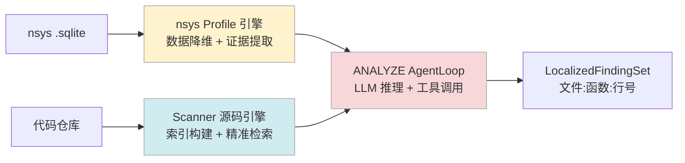

# Analyzer — Profile 分析引擎

Analyzer 是 Sysight 的"眼睛"。它把两种原始输入——nsys profile（动态性能数据）和代码仓库（静态代码）——转换成带源码坐标的结构化 finding 列表，供后续 OPTIMIZE 阶段直接使用。

参考项目：[nsys-ai](https://github.com/GindaChen/nsys-ai)，[code-review-graph](https://github.com/tirth8205/code-review-graph)。

---

## 目录

- [两个子引擎](#两个子引擎)
- [nsys Profile 引擎](#nsys-profile-引擎)
- [Scanner 源码扫描引擎](#scanner-源码扫描引擎)
- [ANALYZE 阶段工作流](#analyze-阶段工作流)
- [Finding 输出格式](#finding-输出格式)
- [设计决策](#设计决策)

---

## 两个子引擎



两个引擎都不直接做"分析"——它们负责把混沌的原始数据降维成 LLM 可以查询的结构化接口。真正的推理由 ANALYZE AgentLoop 中的 LLM 完成。

---

## nsys Profile 引擎

**定位**：将海量原始 profile 数据提炼成高信噪比的"性能证据"。

nsys 的 SQLite 数据库有几十张表，直接给 LLM 读会淹没在噪声里。Profile 引擎做两件事：预计算关键统计数据，和提供工具接口让 LLM 按需查询。

### 预计算摘要（注入 prompt）

在 ANALYZE AgentLoop 启动前，Profile 引擎生成一份摘要直接注入到 user prompt，给 LLM 一个全局视角：

```
── Top GPU Kernels by Total Time ──
ncclDevKernel_AllReduce  440 次  4808.52ms 累计
_attn_bwd                528 次  2536.64ms 累计
ampere_bf16_s16816gemm   8536 次 1319.10ms 累计

── GPU Idle Gaps (Bubbles) ──
Total: 98 gaps, 2718.7ms idle (43.0% of profile)
Distribution: 16 × 1-5ms, 71 × 5-50ms, 11 × >50ms

── Memory Transfers Summary ──
H2D: 1672 次, 12763.87 MB, 713.46ms
D2H: 1584 次, 0.01 MB, 3.68ms

── NCCL Collective Breakdown ──
allreduce: 100.0% 720.9ms ×55, avg=13.1ms
```

这份摘要通常就能让 LLM 直接定位到最值得查的方向，减少后续 10–15 次工具调用。

### 工具接口

LLM 通过 8 个 `nsys_sql_*` 工具按需查询细节：

| 工具 | 说明 | 典型用途 |
|------|------|---------|
| `nsys_sql_gaps` | GPU 空闲间隙分析 | 诊断 GPU idle 原因，按 gap 大小排序 |
| `nsys_sql_kernels` | Top kernel 耗时统计 | 找计算热点，区分 TC / non-TC kernel |
| `nsys_sql_memcpy` | H2D/D2H 搬运统计 | 分析内存搬运频率和带宽 |
| `nsys_sql_sync` | 同步点分析 | 定位 `cudaStreamSynchronize` 调用 |
| `nsys_sql_nvtx` | NVTX 区间耗时 | 分析用户标记的 iter / forward / backward 区间 |
| `nsys_sql_nccl` | NCCL 通信统计 | 分解 all_reduce / all_gather 耗时 |
| `nsys_sql_launch` | Kernel launch 开销 | 量化 CPU → GPU dispatch 的等待时间 |
| `nsys_sql_overlap` | 计算/通信 overlap 分析 | 评估 DDP/FSDP 的 overlap 效率 |

### 实现：SQL 驱动的聚合

所有工具底层是对 SQLite 的直接 SQL 查询，不依赖 nsys 命令行。这样做的好处：
- 可以在没有 nsys 二进制的机器上运行（如分析服务器）
- SQL 聚合比 nsys 原生 report 更灵活，可以自定义分析维度
- 查询结果可缓存，重复查询不重新扫描

```python
# 示例：gaps.py 中计算 GPU 空闲间隙
SELECT
    start_ns,
    end_ns,
    (end_ns - start_ns) / 1e6 AS gap_ms,
    ...
FROM cuda_kernels
WHERE stream_id = ?
ORDER BY gap_ms DESC
LIMIT 20
```

---

## Scanner 源码扫描引擎

**定位**：为 LLM 提供"读代码"的能力，把仓库转换成可查询的结构化接口。

参考：[code-review-graph](https://github.com/tirth8205/code-review-graph) 的图结构索引思路。

### 索引构建

WARMUP 阶段扫描仓库时，Scanner 会建立两类索引：

**目录树索引**：快速探测仓库文件分布，过滤依赖噪声（`.venv`、`site-packages`、`node_modules`）。

**符号索引**：解析所有 `.py` 文件，建立函数、类的全局索引，记录定义位置（文件、行号）。

### 工具接口

| 工具 | 说明 |
|------|------|
| `scanner_read` | 读取文件内容，支持 `start`/`end` 行号范围 |
| `scanner_search` | 全仓库 regex 搜索 |
| `scanner_files` | 列出目录结构 |
| `scanner_symbols` | 查找函数/类的定义位置 |
| `scanner_callers` | 查找调用某函数的所有调用方 |
| `scanner_variants` | 查找代码变体（不同配置分支） |

### 调用链追踪

LLM 在验证 finding 时经常需要追踪调用链。比如 profile 里看到 `DataLoader.__iter__` 很慢，但问题根源在用户代码的某个 `collate_fn`——`scanner_callers` 可以从底层函数反向追溯到上层调用点。

```
profile: H2D memcpy 频繁
  → LLM 怀疑：热路径中有 .to(device) 调用
  → scanner_search(".to(device)") 找到候选位置
  → scanner_read(file, line-5, line+5) 确认上下文
  → scanner_callers("training_step") 确认在训练循环里
  → 输出 finding: C4, file: src/trainers/loop.py, line: 31
```

### 安全边界

Scanner 通过 `path_containment` 只允许读取 repo 内的文件，不能越界访问系统文件。

---

## ANALYZE 阶段工作流

一次典型的 ANALYZE AgentLoop 大约 25–30 turns，约 900K prompt tokens：

```
Turn 1–3:   读取预注入的 profile 摘要 + wiki 历史经验
            → 形成 C1–C7 假设列表

Turn 4–10:  逐个假设验证
            → nsys_sql_* 工具查询细节数据
            → 确认具体的 GPU idle 数值、kernel 列表等

Turn 11–20: 源码定位
            → scanner_search 找候选代码位置
            → scanner_read 确认具体行的代码内容
            → scanner_callers 确认在热路径上

Turn 21–28: 生成最终 findings
            → 对每个确认的问题：写出 finding_id、file_path、function、line
            → 不确定的问题标记为 unresolved，不强行输出
```

整个过程 LLM 自己决定查什么、查几次——只提供工具接口和 C1–C7 分类框架，具体的调查路径不硬编码。

---

## Finding 输出格式

```python
@dataclass
class LocalizedFinding:
    finding_id: str          # "C3:c0c34d37" — 类别:内容hash
    category: str            # "C1" – "C7"
    title: str               # 一句话描述
    priority: str            # "high" | "medium" | "low"
    confidence: str          # "confirmed" | "probable" | "unresolved"
    evidence_refs: list[str] # ["GPU空闲93.1%", "每步有 StreamSynchronize"]
    metric: str              # 关键数值，如 "93.1% idle"
    file_path: str           # "src/train.py"
    function: str            # "train_step"
    line: int                # 154
    description: str         # 详细描述（3–5 句）
    suggestion: str          # 修复建议
    status: str              # "accepted" | "rejected" | "unresolved"
```

一个真实 finding 的示例：

```json
{
  "finding_id": "C7:9ead8a5d",
  "category": "C7",
  "title": "get_batch 逐样本 Python 循环：64 次 uint16→int64 转换",
  "priority": "high",
  "confidence": "confirmed",
  "evidence_refs": [
    "profile 中 H2D memcpy 高频率小块传输",
    "CPU 采样热点在 list comprehension"
  ],
  "file_path": "train.py",
  "function": "get_batch",
  "line": 154,
  "description": "batch_size=32，每次 get_batch 通过 Python list comprehension 做 32×2=64 次单样本 astype(np.int64) 转换，全在主线程串行执行，直接阻塞 GPU 数据供给。",
  "suggestion": "用 numpy 高级索引替换 Python 循环：data[ix[:, None] + np.arange(block_size)].astype(np.int64)"
}
```

---

## 设计决策

### 为什么不让 LLM 直接读 SQL

直接把 SQLite 访问接口暴露给 LLM 有两个问题：一是 LLM 写出的 SQL 可能错误或低效；二是原始表数据（数百万行 kernel 记录）会淹没 context window。

`nsys_sql_*` 工具已经做了聚合计算，每次工具调用返回的是高信噪比的统计结果，而不是原始行数据。

### 为什么 Profile 摘要要预注入

实验表明，如果不预注入摘要，LLM 在前 5–8 turn 会先调用大量基础性工具（"告诉我有哪些表"、"给我看所有 kernel"）建立全局视图。预注入摘要把这些冗余调用从 8 次压缩到 0，节省约 15–20% 的总 token 消耗。

### 为什么 Scanner 不做 AST 语义分析

Sysight 的目标是"精确定位行号"，不需要理解代码语义。简单的符号索引（函数名→位置）+ regex 搜索已经能满足需求，比完整的 AST 分析快且稳定。语义判断留给 LLM 做，这是它的强项。
