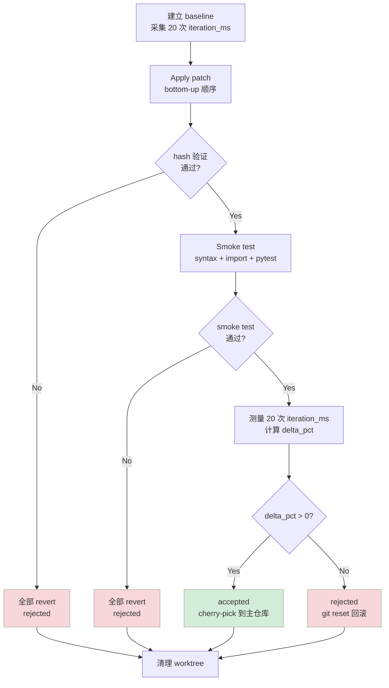

# Optimizer — 代码生成与沙箱验证

Optimizer 负责把 ANALYZE 找到的 finding 变成实际生效的代码改动。它分两个阶段：**OPTIMIZE**（LLM 生成 patch 计划）和 **EXECUTE**（代码侧在沙箱里验证）。

核心原则：**LLM 只负责"想"，代码负责"做"和"量"**。patch 的实际应用、smoke test 和测量都不经过 LLM，彻底避免 AI 自欺欺人。

---

## 目录

- [OPTIMIZE 阶段](#optimize-阶段)
- [EXECUTE 阶段](#execute-阶段)
- [Sandbox — git worktree 隔离](#sandbox--git-worktree-隔离)
- [Patcher — 确定性 patch 应用](#patcher--确定性-patch-应用)
- [度量与决策](#度量与决策)
- [设计决策](#设计决策)

---

## OPTIMIZE 阶段

**类型**：LLM + 工具调用（AgentLoop）。

OPTIMIZE 拿到 ANALYZE 的 findings，LLM 对每个问题：1）阅读目标代码；2）判断真伪；3）生成 patch。

### LLM 的两个主要判断

**判断真伪**：finding 是来自静态分析的推断，可能是假阳性。OPTIMIZE 的 LLM 要读源码做二次确认：
- 如果源码里已经有对应优化 → 跳过（假阳性）
- 如果问题确实存在 → 生成 patch
- 如果不确定 → 跳过，不强行生成

**合并 finding**：同一文件连续区域的多个 finding，合并成一个 patch 一次性修复，减少 apply 次数和 diff 噪声。

### 两阶段执行

```
Phase 1 — Plan（LLM）
  ├── 读取 findings（只传必要字段，节省 token）
  ├── 对每个 finding: scanner_read → 评判 → 生成 PatchCandidate
  └── 输出 patches JSON

Phase 2 — Fill hashes（代码）
  ├── 读取实际文件
  ├── 定位 old_span_start / old_span_end 对应的内容
  └── 计算 SHA256(content) → old_span_hash
```

**为什么 hash 要由代码填充？** LLM 生成的行号可能因为文件被修改过（比如上一轮 LEARN 写入了 overview）而偏移，或者 LLM 数错行。代码侧重新读文件、计算实际内容的 hash，apply 时如果 hash 不匹配就拒绝执行，而不是静默覆错。

### AgentLoop 配置

| 参数 | 值 |
|------|-----|
| max_turns | 20 |
| max_wall_seconds | 600 |
| 可用工具 | `scanner_read`, `scanner_search`, `scanner_files` |

注意：OPTIMIZE 阶段只能读代码，不能写——不允许 LLM 直接修改文件。

### 输出格式

```python
@dataclass
class PatchCandidate:
    patch_id: str               # "patch-train-vectorize"
    finding_ids: list[str]      # 可关联多个 finding
    file_path: str              # "train.py"
    old_span_start: int         # 替换起始行（1-based）
    old_span_end: int           # 替换结束行（1-based, inclusive）
    old_span_hash: str          # 代码侧填充
    replacement: str            # 完整替换内容（含正确缩进）
    rationale: str              # 修改原因
    validation_commands: list   # 语法检查命令
```

一个真实的 PatchCandidate：

```json
{
  "patch_id": "patch-train-vectorize",
  "finding_ids": ["C7:9ead8a5d", "C7:dc88fc27"],
  "file_path": "train.py",
  "old_span_start": 154,
  "old_span_end": 155,
  "replacement": "    x_np = data[ix[:, None] + np.arange(block_size)].astype(np.int64)\n    x = torch.from_numpy(x_np)\n    y_np = data[ix[:, None] + np.arange(block_size) + 1].astype(np.int64)\n    y = torch.from_numpy(y_np)",
  "rationale": "Replace per-sample Python loop (64 astype calls) with numpy advanced indexing (2 batch astype calls). Eliminates 62 redundant type-conversion calls per batch."
}
```

---

## EXECUTE 阶段

**类型**：确定性，不调用 LLM。

EXECUTE 是 Sysight 的安全网。LLM 生成的所有 patch 在这里经过严格的实测验证才能生效。

### 执行流程



**关键细节：bottom-up apply**

同文件多个 patch 时，如果从上往下 apply，第一个 patch 会改变后续 patch 的行号，导致 hash 不匹配。从下往上 apply（行号大的先 apply）则不存在这个问题。

### 度量方式

测量使用实际训练输出里的 `iter ... time Xms`，每次采集 20 个样本取均值，去掉首步（CUDA lazy init）：

```python
primary_metric = "iteration_ms"
metric_before = mean(baseline_samples[1:])   # 去掉 step-0
metric_after  = mean(trial_samples[1:])
delta_pct     = (metric_before - metric_after) / metric_before * 100
# delta_pct > 0 表示性能提升
```

---

## Sandbox — git worktree 隔离

每个 trial 在独立的 git worktree 里运行，与主仓库完全隔离：

```python
# sandbox/create.py
worktree_path = f".sysight/cache/.../worktrees/.sysight-opt-{loop_id}-iter-{n}-{ts}"
subprocess.run(["git", "worktree", "add", worktree_path, "HEAD"])
```

**为什么用 worktree 而不是临时目录？**

worktree 和主仓库共享 git 对象存储，创建只需要几毫秒。而且 worktree 本身就是一个完整的 git repo，可以直接做 `git commit`、`git reset`，回滚逻辑天然正确。

**worktree 生命周期**

```
创建 worktree → apply patch → 测量 → 决策 → cherry-pick（如果 accepted）→ 删除 worktree
```

worktree 在 trial 结束后通过 `atexit.register()` 注册清理，即使程序异常退出也会执行。

**后续迭代的 current_repo**

OPTIMIZE 阶段结束后，主仓库（`root`）才是后续迭代的代码基准，不能依赖已删除的 worktree：

```python
# agent_loop.py — 正确做法
if item.accepted_count > 0 and item.best_commit:
    cherry_err = _cherry_pick_commit(root, item.best_commit)
    if not cherry_err:
        result.final_repo = str(root)
    current_repo = root   # 始终指向主仓库
```

---

## Patcher — 确定性 patch 应用

Patcher 是一个代码组件，不是 LLM 工具——LLM 生成 PatchCandidate，Patcher 负责实际修改文件。

```
PatchApplier.apply(patch, file_content)
  │
  ├── 1. 读取目标文件当前内容
  ├── 2. 提取 old_span_start:old_span_end 的内容
  ├── 3. 计算 SHA256 与 old_span_hash 对比
  │     └── 不匹配 → raise HashMismatchError
  ├── 4. 替换为 replacement
  └── 5. 写回文件

PatchApplier.revert(patch, original_content)
  └── 用 original_content 覆盖当前文件（无条件回滚）
```

Patcher 保存每个被修改文件的原始内容，revert 时无条件覆盖，不依赖 git（因为 worktree 里的改动可能还没 commit）。

---

## 度量与决策

### 为什么 20 次采样取均值

GPU 训练的 iteration time 有自然抖动（CUDA kernel 调度、PCIe 竞争、OS 调度等），单次测量不可靠。20 次采样后：
- baseline mean 的标准误通常在 ±0.3ms 以内
- 对于 10–15ms 量级的训练步，1% 的改进（约 0.1ms）就能稳定检出

### 决策阈值

```
delta_pct = (before - after) / before * 100
threshold = 0.0%  # 严格：只要有任何提升就接受
```

阈值设为 0 而不是更高（比如 3%）是有意为之——测量的 20 次采样已经足够可靠，不需要额外的"显著性缓冲"。如果改动能稳定降低均值，就接受。

### 拒绝的价值

被拒绝的 trial 同样有价值：它的结论（"这个方向在这个 model size 上不划算"）会写入 wiki，避免下一轮重复尝试。Run-2 中 trial-003（deferred `loss.item()`）退步 5.37% 被拒绝，这条经验"MPS 上 D2H defer 没有 overlap 收益"随后写入了 `llmwiki/loss-item-defer-risk.md`。

---

## 设计决策

### 为什么 EXECUTE 不调用 LLM

apply、smoke test、测量都是确定性操作，不需要推理能力。引入 LLM 只会增加延迟和 token 成本，并且 LLM 的"自我评估"（"我认为这个改动应该有效"）不可信——实测对比才可信。

### 为什么 LLM 不能直接修改文件

这是安全边界。如果 LLM 可以直接写文件：
- 没有 hash 验证，写错了不知道
- 没有 revert 机制，写坏了不好恢复
- 没有测量，不知道改动是否真的有效

把"生成计划"和"执行计划"分离，每一步都有明确的责任归属。

### 为什么用 worktree 而不是 stash/branch

stash 和 branch 都需要切换工作目录，会影响正在运行的其他进程。worktree 允许同时存在多个工作目录，主仓库保持不动，trial 在独立空间里运行。
