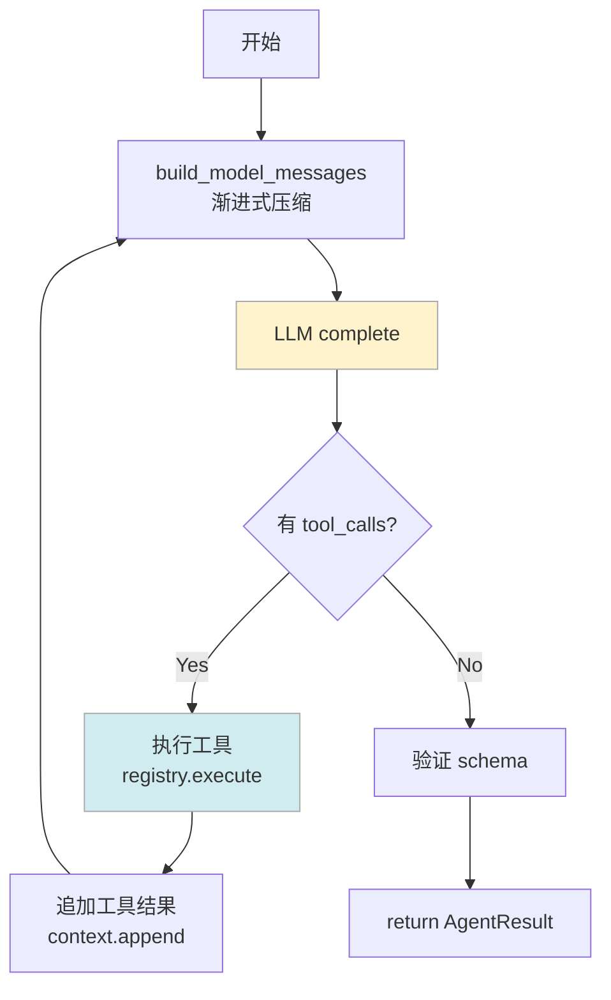

# Agent 层 — AgentLoop 与上下文管理

AgentLoop 是 Sysight 的 LLM 交互引擎。每个需要 LLM 参与的 Pipeline 阶段（ANALYZE、OPTIMIZE、LEARN）都通过一次独立的 `AgentLoop.run()` 完成。

核心设计：**每次 run() 是完全独立的**——不跨阶段继承对话历史，上下文通过结构化 artifact（findings JSON、profile 摘要）传递，而不是靠多轮对话积累。

参考设计：MiniCode / Claude Code / Codex 的渐进式上下文压缩方案。

---

## 目录

- [AgentLoop 循环结构](#agentloop-循环结构)
- [停止条件与重试](#停止条件与重试)
- [上下文管理：为什么难，怎么解](#上下文管理为什么难怎么解)
- [四级渐进式压缩](#四级渐进式压缩)
- [工具调用协议](#工具调用协议)
- [多 Provider 支持](#多-provider-支持)
- [各阶段配置](#各阶段配置)

---

## AgentLoop 循环结构

```
run(task: AgentTask) → AgentResult

while turns < max_turns:
  1. context.build_model_messages()   ← 渐进式压缩
  2. provider.complete(request)        ← 调用 LLM
  3. if response has tool_calls:
       for each tool_call:
         result = registry.execute(name, args, policy)
         context.append_tool_result(result)
     → 继续循环
  4. if response is final output:
       validate schema
       → return AgentResult
```



每次 `build_model_messages()` 都可能触发压缩，确保发给 LLM 的消息列表不超过 context window。

---

## 停止条件与重试

AgentLoop 有 5 种退出方式：

| 停止条件 | 触发 | 状态 |
|---------|------|------|
| **正常完成** | LLM 返回无 tool_calls 的最终输出 | `"ok"` |
| **Schema 错误** | 最终输出不符合 response_schema | `"schema_error"` |
| **工具错误** | 工具协议违规（tool call + text 混用） | `"tool_error"` |
| **超时** | turns > max_turns 或 wall > max_wall_seconds | `"timeout"` |
| **Provider 错误** | LLM API 返回不可重试的错误 | `"provider_error"` |

对于可重试的 provider 错误（rate limit、5xx server error），内置指数退避：

```python
_BACKOFF_S = [5, 10, 20, 30, 40]  # 最多 5 次重试
```

---

## 上下文管理：为什么难，怎么解

ANALYZE 阶段是压力最大的场景。一次典型运行：

```
28 turns
~900K prompt tokens
工具结果：SQL 查询结果（数百行 kernel 数据）+ 源码文件（数百行代码）
```

如果不压缩，到第 15 turn 左右大多数模型的 context window 就满了。

直接截断历史消息不行：LLM 需要记住前面查了什么、得出了什么结论，不然会重复调查。

Sysight 的解法是**渐进式压缩**：根据当前 token 利用率，从轻到重依次触发四个压缩 level，每次都保留"最近的和最重要的"，丢弃"旧的工具结果"。

### Token 估算

采用 **anchor + delta** 方法，避免每次都重新 tokenize 所有消息（很慢）：

```
anchor = 上一次 API 返回的 prompt_tokens（精确值）
delta  = 新增消息的字符数 / 3.5（chars_per_token 经验值）
estimated = anchor + delta
```

典型误差 < 5%，满足压缩触发的精度要求。

### Model-Aware 阈值

所有压缩阈值根据当前模型的实际 context window 自动缩放：

```python
_MODEL_CONTEXT_WINDOWS = {
    "gpt-5.5": 1_000_000,
    "gpt-5.4": 1_000_000,
    "claude-opus-4-6": 1_000_000,
    "claude-sonnet-4-5": 200_000,
    "claude-haiku-4-5": 200_000,
}
```

---

## 四级渐进式压缩

```
utilization = estimated_tokens / context_window_size

Level 0 — Microcompact（≥ 50%）
Level 1 — Large-Result Persistence（始终运行，零成本）
Level 2 — Time-Based Compaction（≥ 70%）
Level 2.5 — Snip（≥ 80%，确定性，不调 LLM）
Level 3 — Token-Pressure Compaction（≥ 95%）
```

### Level 0 — Microcompact

触发条件：utilization ≥ 50%

从对话历史中清除标记为 `COMPACTABLE` 的旧工具结果，只保留最近 `KEEP_RECENT` 条。COMPACTABLE 工具通常是 `scanner_read`（已读过的代码文件）、`nsys_sql_*`（已分析过的 SQL 结果）。

### Level 1 — Large-Result Persistence

始终运行（零模型 token 成本）。

工具结果超过 20K tokens 时，自动持久化到磁盘，只在 context 里保留简短预览：

```
[SYSIGHT_LARGE_RESULT: persisted to .sysight/cache/.../result-abc123.json]
[Preview: Top 5 kernels, GPU idle 43.0%, ...]
```

LLM 看到预览后如果需要完整数据，可以通过 `scanner_read` 重新读取。

### Level 2 — Time-Based Compaction

触发条件：utilization ≥ 70%

用模板生成的摘要替换较旧的工具结果。最近 `keep_recent_turns_full` 轮的结果保持完整，更早的替换为摘要：

```
[COMPACTED] Turn 5: nsys_sql_kernels → "查询了 top kernels，最慢是 ncclAllReduce 4808ms"
[COMPACTED] Turn 7: scanner_read(train.py:120-160) → "读取了 train.py get_batch 函数"
```

### Level 2.5 — Snip

触发条件：utilization ≥ 80%

确定性压缩，不调用 LLM。物理删除中间"安全"区间的消息，保护：
- system 消息（永远保留）
- 最近 N 条消息（保留完整）
- 写操作相关的 tool call（LEARN 阶段的 memory_write，不能丢）

删除位置插入 `snip_boundary` 标记，让 LLM 知道这里有内容被压缩。

### Level 3 — Token-Pressure Compaction

触发条件：utilization ≥ 95%

激进压缩所有旧工具结果，同时注入一条"恢复消息"：

```
[SESSION RECOVERY]
最近读取的文件：train.py (lines 120-180), model.py (lines 50-90)
当前进度：已确认 C7:get_batch 向量化 finding，正在验证 C5:pos tensor 问题
已输出的 findings：[C7:9ead8a5d, C7:dc88fc27]
```

这让 LLM 在上下文被大量压缩后仍能继续工作，而不是"失忆"从头开始。

### Circuit Breaker

如果 Level 3 连续触发 N 次但 token 数还是没有降到阈值以下（说明压缩无效——可能是当前轮的工具结果本身就很大），则阻止进一步压缩并注入警告，让 AgentLoop 尽快输出最终结果。

---

## 工具调用协议

### 基本流程

```
1. LLM 返回 assistant 消息（含 tool_calls）
   → 加入 context

2. 逐个执行 tool call
   → registry.execute(name, args, policy)
   → 结果加入 context（role: "tool"）

3. 下一轮：build_model_messages() 包含所有工具结果
   → 发给 LLM
```

### 协议验证

每次 `build_model_messages()` 前验证消息序列的合法性：
- 不允许 tool call 和 text content 同时存在（Anthropic 模型要求）
- 不允许连续的 `tool` role 消息
- 不允许 tool call 没有对应的 tool result

违规会触发 `AgentLoop` 的 `tool_error` 停止。

### ToolPolicy — 访问控制

每个 Pipeline 阶段有独立的 ToolPolicy，控制 LLM 能访问哪些工具：

```python
@dataclass
class ToolPolicy:
    allowed_tools: set[str]       # 支持通配符 "scanner_*"
    read_only: bool = True
    max_calls_per_task: int = 50
    max_wall_seconds: int = 600
    path_containment: dict        # 路径白名单
```

| 阶段 | 允许的工具 | read_only | max_calls |
|------|-----------|:---------:|:---------:|
| ANALYZE | `nsys_sql_*`, `scanner_*`, `memory_read` | ✅ | 100 |
| OPTIMIZE | `scanner_read`, `scanner_search`, `scanner_files` | ✅ | 30 |
| LEARN | `memory_read`, `memory_search`, `memory_write` | ❌ | 20 |

超出 `max_calls` 的工具调用返回 `"policy_denied"`，不会 raise exception，LLM 会看到错误信息并调整策略。

---

## 多 Provider 支持

AgentLoop 通过 `LLMProvider` 抽象支持多种 LLM backend：

```python
class LLMProvider(ABC):
    @abstractmethod
    def complete(self, request: LLMRequest) -> LLMResponse: ...

@dataclass
class LLMRequest:
    system_prompt: str
    messages: list[dict]
    tools: list[dict] | None
    response_schema: dict | None    # structured output / tool_choice
    max_tokens: int | None
```

目前支持三种 provider：

| Provider | 说明 |
|---------|------|
| `openai_compatible` | OpenAI API 及兼容服务（Azure、本地 vLLM 等） |
| `anthropic` | Claude 系列（使用 Anthropic native API） |
| `replay` | Debug 用途，回放之前的 LLM 响应，不调真实 API |

`replay` provider 对 debug 很有价值：可以用之前记录的 `debug.log` 重放一次完整的 ANALYZE 过程，不用消耗 token，也不用等待 API 响应。

---

## 各阶段配置

```python
# AgentTask — 任务定义
@dataclass
class AgentTask:
    run_id: str
    task_id: str
    task_type: str                 # "analyze" | "optimize" | "learn"
    system_prompt: str
    user_prompt: str               # 含预注入数据
    response_schema: dict | None   # 最终输出的 JSON Schema
    max_turns: int = 30
    max_wall_seconds: int = 600
    max_tokens: int | None
    context_policy: ContextPolicy
```

| 阶段 | max_turns | max_wall_s | 压缩特点 |
|------|:---------:|:----------:|---------|
| ANALYZE | 30 | 600 | 最重压缩，工具结果多（SQL + 源码） |
| OPTIMIZE | 20 | 600 | 中等压缩，主要是源码读取结果 |
| LEARN | 10 | 120 | 轻压缩，工具结果小（wiki 页面） |

推荐模型配置：

| 阶段 | 推荐 | 原因 |
|------|------|------|
| ANALYZE | GPT-5 / Claude Opus 4+ | 强推理能力，turns 多，context 大 |
| OPTIMIZE | GPT-5 / Claude Sonnet 4+ | 精确代码理解 |
| LEARN | Claude Haiku / GPT-4o-mini | 归纳总结，不需要最强推理 |

ANALYZE 一次典型运行消耗约 900K prompt tokens，建议使用 context window ≥ 200K 的模型。
