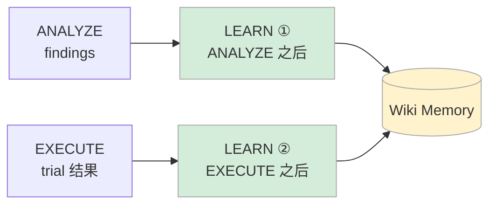

# Wiki Memory — 知识库与 LEARN 阶段

Sysight 有记忆。每轮 Pipeline 的分析结果和优化经验，会通过 LEARN 阶段写入 Wiki Memory，下一轮自动参考。

两个核心设计原则：
- **Parent-only writes**：只有 LEARN 阶段可以写 wiki，子 Agent（ANALYZE、OPTIMIZE）只读不写
- **Workspace 隔离 + Global 共享**：每个仓库有自己的 namespace，通用经验跨仓库共享

---

## 目录

- [存储结构](#存储结构)
- [LEARN 阶段工作流](#learn-阶段工作流)
- [Wiki 如何影响下一轮 ANALYZE](#wiki-如何影响下一轮-analyze)
- [WikiRepository — CRUD 接口](#wikirepository--crud-接口)
- [RunLedger — 运行记录](#runledger--运行记录)
- [设计决策](#设计决策)

---

## 存储结构

```
.sysight/memory/wiki/
├── workspaces/
│   └── <namespace>/                # 每个仓库一个 namespace（路径 hash）
│       ├── overview.md             # WARMUP 生成：入口、热路径、调用关系
│       └── experience.md          # LEARN 写入：该仓库特有的优化经验
└── llmwiki/                        # 全局共享经验（跨仓库可复用）
    ├── numpy-data-loading-vectorization.md
    ├── torch-arange-buffer-reuse.md
    ├── np-memmap-handle-caching.md
    ├── torch-compile-small-model.md
    └── loss-item-defer-risk.md
```

**namespace 生成**：`namespace = hash(repo_root_path)[:8]`，同一仓库始终映射到同一 namespace，不同仓库互不干扰。

**两级经验**：
- `workspaces/<ns>/experience.md` — 该仓库特有的经验（"这个项目的 DataLoader 配置在 configs/train.yaml 第 42 行"）
- `llmwiki/*.md` — 跨仓库通用的优化模式（"Python 循环内逐 token 调用 embedding 会触发大量微 kernel"）

新仓库进来可以直接从 `llmwiki` 受益，不会被其他仓库的特定信息干扰。

### 页面格式

每个 wiki 页面使用 YAML frontmatter + Markdown body：

```markdown
---
title: "numpy data loading vectorization"
category: "optimization-pattern"
tags: ["C7", "data-loading", "numpy"]
scope: "global"
source_run: "loop-09416582-1778480754"
updated_at: "2026-05-11T07:53:46Z"
---

# numpy data loading vectorization

## 问题模式
get_batch 内 Python list comprehension 对每个样本分别做 astype() 转换。
batch_size=32 时每次 get_batch = 64 次单样本转换，全部串行在主线程。

## 修复方案
numpy 高级索引批量转换：
```python
x_np = data[ix[:, None] + np.arange(block_size)].astype(np.int64)
```

## 实测效果
nanoGPT case: 14.955ms → 14.336ms (-4.14%)

## 注意事项
需要确认 data 是 numpy array 而非 memmap 的 view，否则高级索引会 materialize 整个数组。
```

---

## LEARN 阶段工作流

LEARN 在 Pipeline 中调用两次，每次输入不同：



### LEARN ① — ANALYZE 之后

**输入**：ANALYZE 输出的 findings（带证据链）

**LLM 任务**：从 findings 模式中提取可复用知识：
- 这个仓库常见哪类问题（C1-C7 分布）
- 哪些特定文件/函数有已知问题
- profile 里的哪些 signal 直接对应了哪类问题

**典型写入**：更新 `workspaces/<ns>/experience.md`，新增"本次 finding 摘要"和"已知问题路径列表"。

### LEARN ② — EXECUTE 之后

**输入**：findings + PatchCandidate[] + TrialResult[]（含 delta_pct）

**LLM 任务**：分析优化效果，提取经验：
- 哪些优化确实有效（timer 证实），原因是什么
- 哪些 finding 是假阳性（OPTIMIZE 拒绝了），为什么
- 哪些技巧可以推广到其他仓库（写入 `llmwiki`）
- 哪些方向在特定环境下不适用（如 MPS 上 deferred sync 无效）

### AgentLoop 配置

| 参数 | 值 |
|------|-----|
| max_turns | 10 |
| max_wall_seconds | 120 |
| 可用工具 | `memory_read`, `memory_search`, `memory_write` |

### 输出格式

```json
{
  "summary": "Added defer-loss rejection note to Sync Points section. Wrote two cross-project experience pages about numpy vectorization and loss.item() defer risks.",
  "memory_updates": [
    {
      "path": "workspaces/nanogpt-sysight/experience.md",
      "action": "append",
      "content": "## loss.item() deferred sync\ntrial-003 实测退步 5.37%..."
    },
    {
      "path": "llmwiki/loss-item-defer-risk.md",
      "action": "write",
      "content": "# loss.item() defer 在 MPS 上无效\n..."
    }
  ]
}
```

### 安全边界

LEARN 只能写入 `workspaces/` 和 `llmwiki/` 路径，写入其他路径会被拒绝：

```python
def _apply_memory_update(update, knowledge):
    path = update.get("path", "")
    allowed = path.startswith("workspaces/") or path.startswith("llmwiki/")
    if not allowed:
        return  # 静默拒绝，记录到 errors
```

**为什么不允许写其他路径？** 防止 LLM 意外覆盖系统配置或污染其他仓库的 namespace。

### Fallback：write → append

如果 LLM 指定 `action: replace` 但 `old` 文本在文件里找不到（可能是文件被其他 session 修改过），自动降级为 `append`，确保信息不丢失：

```python
try:
    knowledge.replace_in_page(path, old_text, new_text)
except TextNotFoundError:
    knowledge.append_page(path, f"\n\n{new_text}")  # fallback
```

---

## Wiki 如何影响下一轮 ANALYZE

Wiki 在 ANALYZE 启动前通过两个路径影响 LLM：

### 预注入到 user prompt

```python
# analyze.py — _build_global_brief()
brief_parts = []

# workspace overview（WARMUP 生成）
overview = knowledge.read_page(f"workspaces/{ns}/overview.md")
if overview:
    brief_parts.append(f"## Workspace Overview\n{overview}")

# workspace 特有经验
experience = knowledge.read_page(f"workspaces/{ns}/experience.md")
if experience:
    brief_parts.append(f"## Past Experience\n{experience}")

# 全局经验（截取前 2000 字符，避免 prompt 过长）
global_exp = knowledge.read_page("llmwiki/...")
if global_exp:
    brief_parts.append(f"## Global Experience\n{global_exp[:2000]}")
```

预注入的内容让 LLM 在第一轮就有背景知识，减少 10–15 次"重新发现已知问题"的工具调用。

### 可检索（memory_search 工具）

ANALYZE 的 LLM 也可以主动检索 wiki，查找和当前 finding 相关的历史经验：

```
LLM: 发现 C7 类型问题
→ memory_search("C7 data loading vectorization")
→ 找到 llmwiki/numpy-data-loading-vectorization.md
→ 直接参考修复方案，跳过重复验证
```

---

## WikiRepository — CRUD 接口

```python
class WikiRepository:
    def read_page(path: str) -> str | None
    def write_page(path: str, content: str) -> Path
    def append_page(path: str, content: str) -> None
    def replace_in_page(path: str, old: str, new: str) -> None
    def search(query: str) -> list[dict]   # 简单 grep 搜索
```

所有路径相对于 `.sysight/memory/wiki/`。

`search()` 目前是基于 grep 的简单实现（关键词匹配），足以满足当前的检索需求。未来可以升级为向量搜索。

---

## RunLedger — 运行记录

RunLedger 记录每次 Pipeline 运行的元信息，用于追踪历史和 debug：

```python
class RunLedger:
    def record_session(run_id, memory_namespace, stage, ...) -> None
    def recent_session(run_id) -> dict | None
```

记录内容：
- `run_id` 和 `loop_id`
- `memory_namespace`（对应的 wiki namespace）
- 各阶段完成时间戳
- 错误记录

RunLedger 的内容不会注入到 LLM prompt，只供开发者查看和 debug。

---

## 设计决策

### 为什么用文件而不是数据库

1. **可读性**：Markdown 可以直接查看、编辑，方便 debug 时直接看 wiki 内容
2. **LLM 友好**：Markdown 是 LLM 最擅长处理的格式，不需要额外的结构化 prompt
3. **可版本控制**：wiki 内容可以纳入 git，历史可追溯
4. **零依赖**：不需要额外的数据库服务

### 为什么 Parent-only writes

如果 ANALYZE 可以写 wiki，它可能会把"可能的问题"写进去，污染 knowledge base。只有 LEARN 阶段经过"findings + 实测验证"的完整闭环之后，才把结论写入 wiki。这保证了 wiki 的质量。

### 为什么要两级经验（workspace vs global）

仓库特定的经验（"这个仓库的问题在第 42 行"）对其他仓库没有价值。全局经验（"Python 循环内做逐 token 转换是 C7 反模式"）对所有仓库有价值。两级分开存储，新仓库从 global 受益，不被其他仓库的特定信息干扰。
