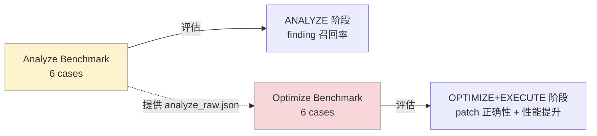

# 基准测试体系

Sysight 设计了两套独立的基准测试，分别评估两种能力：**从 profile 中找问题**，和**从 finding 中生成正确 patch**。

---

## 目录

- [两套测试的关系](#两套测试的关系)
- [Analyze Benchmark — 分析能力](#analyze-benchmark--分析能力)
- [Optimize Benchmark — 优化能力](#optimize-benchmark--优化能力)

---

## 两套测试的关系



两套测试解耦：Optimize Benchmark 使用预构建的 `analyze_raw.json`，不依赖 Analyze 阶段的实际输出，可以独立评估 optimizer 质量。

---

## Analyze Benchmark — 分析能力

**评估目标**：给定 nsys profile 和代码仓库，能否找出所有预埋的性能问题。

**数据集**：6 个场景，覆盖主流 GPU 训练/推理模式：

| Case | 场景 | 预埋 finding 数 | 核心考点 |
|------|------|:--------------:|---------|
| case_1 | 单卡训练 | 16 | DataLoader 阻塞、D2H 同步、逐步 host 操作 |
| case_2 | 多卡 DDP | 17 | NCCL overlap 不足、barrier 配置、通信效率 |
| case_3 | 推理服务 | 17 | KV cache 失效、batching 策略、推理循环开销 |
| case_4 | 混合精度训练 | 16 | AMP 配置错误、gradient checkpoint、pipeline 调度 |
| case_5 | Pipeline 并行 | 17 | micro-batch 设置、stage 调度、通信隐藏 |
| case_6 | 多模态训练 | 17 | vision-text fusion 开销、跨模态同步 |

### Case 结构

每个 case 包含：

```
case_X/
├── case.yaml                    # case 元信息（profile 路径、入口命令）
├── configs/                     # 配置文件
├── profiles/baseline.sqlite     # nsys profile
├── src/                         # 含预埋问题的源码
└── tests/findings/
    └── case_X_findings.json     # ground truth
```

### Ground Truth 格式

```json
{
  "case_id": "case_1",
  "total_points": 16,
  "findings": [
    {
      "id": "case_1_f001",
      "category": "C4",
      "file": "src/trainers/loop.py",
      "function": "training_step",
      "line": 31,
      "score": 1,
      "needle": "images = batch[\"images\"].to(self.device)",
      "description": "Image batch is transferred to the target device inside every training step."
    }
  ]
}
```

### 评分方式

ANALYZE 输出 findings 后与 ground truth 四要素匹配：

```
match = (finding.category == truth.category)
     AND (finding.file_path == truth.file)
     AND (finding.function == truth.function)
     AND (finding.line == truth.line)
```

得分 = 匹配到的 finding 数，满分 = ground truth 总数。行号必须精确匹配。

---

## Optimize Benchmark — 优化能力

**评估目标**：给定 findings（含真假混合），能否正确判断真伪并生成有效 patch。

### Case 结构

每个 case 包含预构建的中间产物，不需要实际运行 ANALYZE：

```
case_X/
├── case.yaml
├── src/                         # 含预埋问题的源码
├── artifacts/
│   ├── analyze_raw.json         # 模拟 ANALYZE 输出（含真假 finding）
│   ├── instrument_result.json   # 计时器规格
│   ├── timer_before.json        # baseline 计时数据
│   └── warmup_result.json
└── tests/findings/
    └── case_X_ground_truth.json
```

### Ground Truth 格式

```json
{
  "case_id": "case_1",
  "max_score": 100,
  "real_finding_ids": ["C5:3f8a1b2c", "C3:a1b2c3d4"],
  "fake_finding_ids": ["C4:f6a7b8c9"],
  "expected_patch_lines": {
    "C5:3f8a1b2c": 15,
    "C3:a1b2c3d4": 8
  }
}
```

### 四维评分

| 维度 | 权重 | 评分规则 |
|------|:----:|---------|
| **Correctness** | 40 | 所有 patch apply 成功 + smoke test 通过 → 40；apply 成功但 smoke 失败 → 20；apply 失败 → 0 |
| **Performance** | 30 | 对每个 real finding：timer delta < −5% → 1.0；delta < 0 → 0.5；否则 → 0。取平均 × 30 |
| **Judgment** | 20 | 正确接受 real finding（TP）、正确拒绝 fake finding（TN）的 F1 分数 × 20 |
| **Minimality** | 10 | patch 行数 ≤ 期望 × 1.2 → 1.0；≤ 期望 × 2.0 → 0.5；否则 → 0。取平均 × 10 |

两套测试的 runner 实现在 `sysight/benchmark/`，评分脚本分别为 `score_answer.py`（analyze）和 `score_optimizer.py`（optimize），数据集作为独立仓库管理。
