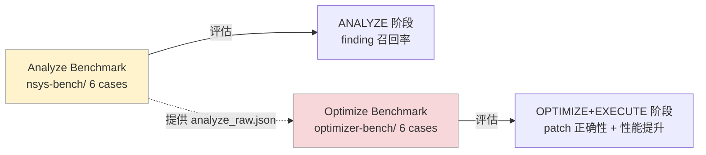

# 基准测试体系

Sysight 有两套独立的基准测试，分别评估两种能力：**从 profile 中找问题**，和**从 finding 中生成正确 patch**。

---

## 目录

- [两套测试的关系](#两套测试的关系)
- [Analyze Benchmark — 分析能力](#analyze-benchmark--分析能力)
- [Optimize Benchmark — 优化能力](#optimize-benchmark--优化能力)
- [SOTA 追踪](#sota-追踪)
- [运行方式](#运行方式)

---

## 两套测试的关系



两套测试解耦：Optimize Benchmark 使用预构建的 `analyze_raw.json`，不依赖 Analyze 阶段的实际输出。这样可以独立评估 optimizer 的质量，不受 analyzer 好坏的影响。

---

## Analyze Benchmark — 分析能力

**评估目标**：给定 nsys profile 和代码仓库，能否找出所有预埋的性能问题。

**数据集**：`nsys-bench/cases/`，6 个场景覆盖主流 GPU 训练/推理模式。

### 6 个 Case

| Case | 场景 | 预埋 finding 数 | 核心考点 |
|------|------|:--------------:|---------|
| case_1 | 单卡训练 | 16 | DataLoader 阻塞、D2H 同步、逐步 host 操作 |
| case_2 | 多卡 DDP | 17 | NCCL overlap 不足、barrier 配置、通信效率 |
| case_3 | 推理服务 | 17 | KV cache 失效、batching 策略、推理循环开销 |
| case_4 | 混合精度训练 | 16 | AMP 配置错误、gradient checkpoint、pipeline 调度 |
| case_5 | Pipeline 并行 | 17 | micro-batch 设置、stage 调度、通信隐藏 |
| case_6 | 多模态训练 | 17 | vision-text fusion 开销、跨模态同步 |

### Case 结构

```
nsys-bench/cases/case_1/
├── case.yaml                          # case 元信息
├── configs/                           # 配置文件
├── profiles/baseline.sqlite           # nsys profile
├── src/                               # 含预埋问题的源码
│   ├── trainers/
│   ├── models/
│   ├── data/
│   └── utils/
└── tests/findings/
    └── case_1_findings.json           # ground truth
```

### Ground Truth 格式

每个预埋问题对应 ground truth 中的一条记录，包含精确的类别、文件、函数、行号：

```json
{
  "case_id": "case_1",
  "total_points": 16,
  "findings": [
    {
      "id": "case_1_f001",
      "category": "C4",
      "file": "src/trainers/loop.py",
      "function": "training_step",
      "line": 31,
      "score": 1,
      "needle": "images = batch[\"images\"].to(self.device)",
      "description": "Image batch is transferred to the target device inside every training step."
    }
  ]
}
```

### 评分方式

Sysight 的 ANALYZE 输出 findings 后与 ground truth 四要素匹配：

```
match = (finding.category == truth.category)
     AND (finding.file_path == truth.file)
     AND (finding.function == truth.function)
     AND (finding.line == truth.line)
```

得分 = 匹配到的 finding 数，满分 = ground truth 总数。

这个评分比较严格——行号必须精确匹配，不接受"大概在这个函数里"的定位。

### SOTA 成绩

| Case | 满分 | SOTA | 准确率 |
|------|:----:|:----:|:------:|
| case_1 | 16 | 15 | 94% |
| case_2 | 17 | 17 | **100%** |
| case_3 | 17 | 12 | 71% |
| case_4 | 16 | 9 | 56% |
| case_5 | 17 | 17 | **100%** |
| case_6 | 17 | 15 | 88% |

case_4（混合精度训练）和 case_3（推理服务）是目前最难的两个，涉及较多框架内部行为，profile 证据和源码的关联更复杂。

---

## Optimize Benchmark — 优化能力

**评估目标**：给定 findings（含真假混合），能否正确判断真伪并生成有效 patch。

**数据集**：`optimizer-bench/cases/`，6 个 case，每个有预构建的 analyze 结果（不需要实际运行 ANALYZE）。

### Case 结构

```
optimizer-bench/cases/case_1/
├── case.yaml
├── src/                               # 含预埋问题的源码
├── artifacts/                         # 预构建的中间产物
│   ├── analyze_raw.json               # 模拟 ANALYZE 输出（含真假 finding）
│   ├── instrument_result.json         # 计时器规格
│   ├── timer_before.json              # baseline 计时数据
│   └── warmup_result.json
└── tests/findings/
    └── case_1_ground_truth.json       # ground truth
```

### Ground Truth 格式

```json
{
  "case_id": "case_1",
  "max_score": 100,
  "real_finding_ids": ["C5:3f8a1b2c", "C3:a1b2c3d4", "C5:e4f5a6b7"],
  "fake_finding_ids": ["C4:f6a7b8c9"],
  "expected_patch_lines": {
    "C5:3f8a1b2c": 15,
    "C3:a1b2c3d4": 8
  }
}
```

`real_finding_ids`：真问题，应该被 OPTIMIZE 接受并生成 patch。
`fake_finding_ids`：假问题（假阳性），应该被 OPTIMIZE 拒绝。
`expected_patch_lines`：期望的 patch 行数（用于 Minimality 评分）。

### 四维评分

| 维度 | 权重 | 评分规则 |
|------|:----:|---------|
| **Correctness** | 40 | 所有 patch apply 成功 + smoke test 通过 → 40；apply 成功但 smoke 失败 → 20；apply 失败 → 0 |
| **Performance** | 30 | 对每个 real finding：timer delta < −5% → 1.0；delta < 0 → 0.5；否则 → 0。取平均 × 30 |
| **Judgment** | 20 | 正确接受 real finding（TP）、正确拒绝 fake finding（TN）的 F1 分数 × 20 |
| **Minimality** | 10 | patch 行数 ≤ 期望 × 1.2 → 1.0；≤ 期望 × 2.0 → 0.5；否则 → 0。取平均 × 10 |

典型输出：

```
========================================================================
  OPTIMIZER BENCHMARK SUMMARY  20260507-201037
========================================================================
  case_1: 85/100 (5 patches, 120.5s)
    Correctness:  40/40
    Performance:  25/30
    Judgment:     20/20  (TP=5 FP=0 FN=0 TN=1)
    Minimality:    0/10
  ────────────────────────────────────────
  GRAND TOTAL: 85/100
========================================================================
```

这次 case_1 的 Minimality 得 0 说明 patch 行数明显超过预期——LLM 倾向于写更详细的注释或保留更多上下文，后续可以优化 prompt 约束。

### 自动快照/恢复

Optimize Benchmark 在每个 case 运行前后自动快照/恢复源文件，确保 patch 不会污染仓库，下一次运行从干净状态开始。

---

## SOTA 追踪

`.sysight/bench-runs/sota.md` 记录每个 case 历史最高分：

```markdown
| Case | SOTA | Run | 说明 |
|------|------|-----|------|
| case_1 | 15/16 (94%) | 20260507-181026 | 漏掉了一个 C2 finding |
| case_2 | 17/17 (100%) | 20260507-172253 | |
| case_3 | 12/17 (71%) | 20260508-100540 | KV cache 相关 3 条漏掉 |
...
```

统计口径：每个 case 在某次 bench run 中的最高 `score/total`，跨 run 取历史最高。

---

## 运行方式

### Analyze Benchmark

```bash
# 单个 case
python -m sysight.benchmark --cases case_1

# 所有 case
python -m sysight.benchmark --all

# debug 模式（打印 LLM I/O）
python -m sysight.benchmark --cases case_1 --debug
```

每个 case 的输出目录：

```
.sysight/bench-runs/<timestamp>/case_1/
├── analyze_raw.json     # 完整 findings
├── answer.json          # 用于评分的精简格式
├── score.json           # 评分结果
└── debug.log            # 逐轮 LLM 交互日志
```

### Optimize Benchmark

```bash
# 单个 case
sysight bench-optimize case_1

# 所有 case
sysight bench-optimize --all

# debug 模式
sysight bench-optimize case_1 --debug
```

每个 case 的输出目录：

```
.sysight/optimizer-bench-runs/<timestamp>/case_1/
├── optimize_debug.log
├── optimize_loop_result.json   # trial 详情
└── score.json                  # 四维评分
```

### 完整 bench run 汇总

```
.sysight/bench-runs/<timestamp>/
├── case_1/
├── case_2/
...
└── summary.txt

Analyze Benchmark Results  20260507-181026
──────────────────────────────────────────
Case    Score  Turns   Tokens    Time     %
case_1  15/16     28  897,772  17m13s   94%
case_2  15/17     32  1,021k   22m53s   88%
──────────────────────────────────────────
TOTAL   30/33     60  1,919k   40m06s   91%
```
