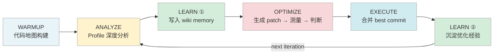
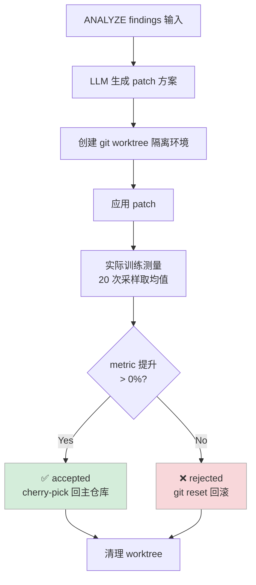
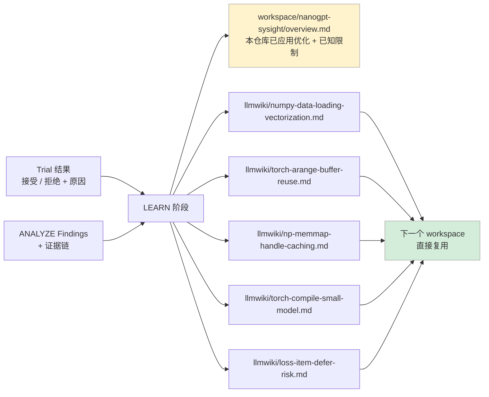

# 用 AI 自动化优化 nanoGPT 训练：两轮 Pipeline 全记录

**核心结论：** 在 nanoGPT Shakespeare 字符级训练任务上，Sysight 无需人工干预，自动完成了 profile 分析 → 问题定位 → patch 生成 → 效果验证的完整闭环，两轮共 6 个 trial，最终将单步迭代时间从 **14.12ms 压缩到 12.96ms，提升 8.2%**。整个过程人的介入只有两处：提供 nsys profile，以及最后读结果。

---

## 目录

- [一、整体结果速览](#一整体结果速览)
- [二、为什么要做这件事](#二为什么要做这件事)
- [三、Pipeline 是怎么工作的](#三pipeline-是怎么工作的)
- [四、Profile 分析找到了什么问题](#四profile-分析找到了什么问题)
- [五、Run-1：第一轮三个 Trial 的故事](#五run-1第一轮三个-trial-的故事)
- [六、Run-2：收敛与链路 Bug 修复](#六run-2收敛与链路-bug-修复)
- [七、两个被拒绝的方向为什么对](#七两个被拒绝的方向为什么对)
- [八、经验如何被沉淀](#八经验如何被沉淀)
- [九、遗留问题与下一步](#九遗留问题与下一步)

---

## 一、整体结果速览

### 两轮 Run 汇总

| Run | 起始 `iter_ms` | 最终 `iter_ms` | 提升 | 接受 / 拒绝 | 迭代轮数 |
|-----|:-----------:|:-----------:|:----:|:-----------:|:------:|
| Run-1 `1778474738` | 14.955 ms | 13.816 ms | **↓ 7.62%** | 2A / 1R | 1 iter |
| Run-2 `1778480754` | 14.119 ms | 12.956 ms | **↓ 8.23%** | 1A / 2R | 2 iters |

### 全部 6 个 Trial 一览

| Run | Trial | 优化策略 | 前 (ms) | 后 (ms) | 变化 | 结果 |
|-----|-------|----------|:-------:|:-------:|:----:|:----:|
| Run-1 | trial-001 | 向量化 `get_batch` 数据加载 | 14.955 | 14.336 | **↓ 4.14%** | ✅ accepted |
| Run-1 | trial-002 | `torch.compile` + memmap 缓存（捆绑） | 14.336 | 15.032 | ↑ 4.86% | ❌ rejected |
| Run-1 | trial-003 | memmap 缓存 + pos buffer 预注册 | 14.336 | 13.816 | **↓ 3.63%** | ✅ accepted |
| Run-2 | trial-001 | 三项 CPU 优化合并（最优组合） | 14.119 | 12.956 | **↓ 8.23%** | ✅ accepted |
| Run-2 | trial-002 | `torch.compile`（独立 patch） | 12.956 | — | patch hash miss | ❌ rejected |
| Run-2 | trial-003 | deferred `loss.item()` sync | 12.956 | 13.652 | ↑ 5.37% | ❌ rejected |

### Run-2 Trial-001 采样分布对比（20 次采样）

```
Baseline   min=12.72  ─────────────────────────────── max=15.32   mean=14.12ms  range=2.60ms
Optimized  min=12.36  ──────────────────  max=13.28              mean=12.96ms  range=0.92ms
```

抖动从 ±1.3ms 收窄到 ±0.46ms，CPU 端的随机扰动少了 64%。

---

## 二、为什么要做这件事

性能优化这件事有个隐藏的成本：profiling 工具和代码之间的跳转。工程师通常要花大量时间在"看 profile 发现问题 → 找到对应代码 → 评估改动收益 → 写 patch → 验证"这个循环上，每一步都需要人在工具和代码之间切换上下文。

Sysight 要解决的问题很直接：给一份 nsys profile，给一个代码仓库，让 AI 自己把这个循环跑完。

这件事有几个卡点不好处理——

- **Profile 数据是 SQLite，有几十张表**，LLM 要懂怎么查、查什么
- **改了代码得实际跑起来量时间**，不然 AI 会自欺欺人（生成了不会变慢的"优化"）
- **改错了要能自动回滚**，不能让仓库进入坏状态
- **多轮迭代之间要有记忆**，不能每次从零开始重复发现同样的问题

这次选 nanoGPT 作为验证对象，理由很简单：代码干净、问题实际、社区熟悉，Shakespeare 字符级任务小到可以在笔记本上跑，大到 profile 里确实能看到问题。验证完在 Mac 上跑通之后，下一步是上八卡服务器。

---

## 三、Pipeline 是怎么工作的

整个流程五个阶段，全自动：



**WARMUP** 扫代码库建地图：入口文件在哪、热路径是什么、最小可运行命令是什么。这步确定性的，不调 LLM。

**ANALYZE** 拿 nsys profile 的 SQLite 数据库，LLM 自主查询分析。没有让模型"看图猜结论"，而是给了一套结构化工具：查 GPU kernel 时序、查 sync event、查 D2H memcpy、查 NVTX range，模型自己决定查什么、怎么解读。一轮分析约 15–20 次工具调用，输出带文件路径和行号的 finding 列表。

**OPTIMIZE** 是核心内循环，每个 trial 走一遍下面这个流程：



**LEARN** 把 trial 结论写入跨 workspace 的 wiki memory，下一轮遇到类似 finding 直接参考，不重复踩坑。

---

## 四、Profile 分析找到了什么问题

ANALYZE 阶段给出的核心结论很干脆：

> **GPU 空转率 91.9%** — trace 里 GPU compute 只占 8.1%，剩下的时间 GPU 在等 CPU

这不全是模型小的原因，而是训练循环里三处 CPU 端隐性开销每步都在打断 GPU 节奏。

### 问题一：每个 batch 重新打开 memmap 文件

```python
# train.py — 原始代码，每次 get_batch 都走这里
def _get_data_memmap(split):
    filename = 'train.bin' if split == 'train' else 'val.bin'
    return np.memmap(os.path.join(data_dir, filename), dtype=np.uint16, mode='r')
```

`np.memmap` 每次调用都要打开文件句柄、建立内存映射。一次 24 步的 warmup 测量就是 **27 次不必要的文件 I/O**。

### 问题二：每次 forward 重新生成 position tensor

```python
# model.py:174 — 每次 forward pass 都执行
pos = torch.arange(0, t, dtype=torch.long, device=device)
```

`t = block_size = 128` 是常量，但每步 forward 都在 GPU 上 launch 一个小 kernel 生成这个 tensor。**27 步 = 27 次本可避免的 CUDA kernel launch**，每次都打断 GPU pipeline。

### 问题三：逐样本串行的数据类型转换

```python
# train.py — 原始 get_batch
x = torch.stack([torch.from_numpy((data[i:i+block_size]).astype(np.int64)) for i in ix])
y = torch.stack([torch.from_numpy((data[i:i+block_size]).astype(np.int64)) for i in ix])
```

`batch_size=32`，每次 `get_batch` 要做 **64 次** `uint16 → int64` 单样本转换，全部 Python 循环，全部串行，全部在主线程上挡着 GPU。

### 问题四：`loss.item()` 同步阻塞

Profile 每步都记录到 `CUPTI_ACTIVITY_SYNCHRONIZATION_TYPE_STREAM_SYNCHRONIZE`，`loss.item()` 强制 CPU 等 GPU 完成当前步才能进下一步 forward。理论上推迟这个调用可以把等待时间和下一步 forward 重叠——实测结论不支持，原因见第七节。

---

## 五、Run-1：第一轮三个 Trial 的故事

Run-1 是首次完整链路验证，**1 iter，3 trials，2 accepted**，baseline 14.955ms → 最终 13.816ms（↓ 7.62%）。

### Trial 决策流

| 步骤 | commit | `iter_ms` | 决策 |
|------|--------|:---------:|:----:|
| baseline | `22c1ace3` | 14.955 | — |
| trial-001：向量化 `get_batch` | `0dbcc69c` | 14.336 | ✅ accepted (+4.14%) |
| trial-002：compile + memmap（捆绑） | rollback | 15.032 | ❌ rejected (−4.86%) |
| trial-003：memmap 缓存 + pos buffer | `5e038415` | 13.816 | ✅ accepted (+3.63%) |

**Trial-001** 只做了一件事：把 `get_batch` 里的 Python 循环换成 numpy 高级索引：

```python
# 改之前：64 次单样本 Python loop
x = torch.stack([torch.from_numpy((data[i:i+block_size]).astype(np.int64)) for i in ix])

# 改之后：numpy 高级索引 + 2 次批量转换
x_np = data[ix[:, None] + np.arange(block_size)].astype(np.int64)
x    = torch.from_numpy(x_np)
```

一行变两行，GPU 等待时间减少 4.14%。

**Trial-002** 把 `torch.compile` 和 memmap 缓存捆绑进了同一个 trial，结果整体退步 4.86%。compile 在小模型（4 层，n_embd=128）上 shape 特化开销大于融合收益，直接让结果变差。这也埋下了一个教训：**不同方向的 patch 应该分开测，不然一个拖累了另一个，还不知道是谁的问题**。Run-2 为此把 compile 单独拆出来。

**Trial-003** 做了剩下两处 CPU 优化：

```python
# config/sysight_baseline.py
reload_memmap_each_batch = False   # 关掉每次重载

# model.py __init__
self.register_buffer('pos', torch.arange(0, config.block_size, dtype=torch.long))

# model.py forward
pos = self.pos[:t]   # view，0 copy，0 kernel launch
```

再降 3.63%，两次 accepted 累计 14.955 → 13.816ms。

---

## 六、Run-2：收敛与链路 Bug 修复

Run-2 是 bug fix 后的稳定性验证轮，**2 iters，3 trials，1 accepted**，14.119ms → 12.956ms（↓ 8.23%）。

### Iter-1：三合一最优组合

LLM 读取了 Run-1 积累的 wiki 经验，直接将三项已证明有效的 CPU 优化合并成一个 trial 一次性提交：

```
trial-001 = patch-config-memmap
           + patch-model-pos-buffer  
           + patch-model-pos-usage
           + patch-train-vectorize
```

结果是 6 个 trial 里单次提升最大的一次：**14.119ms → 12.956ms，↓ 8.23%**。

随后 trial-002（compile）和 trial-003（deferred sync）分别探索了更激进的方向，均被正确拒绝，细节见第七节。

### Iter-2：一次链路 Bug 暴露

Iter-2 没有产生任何 trial，但暴露了一个关键问题。

OPTIMIZE 阶段结束后会清理 worktree 目录，但 iter-2 的 ANALYZE 还试图 `git rev-parse HEAD` 到那个已删除的路径：

```
git rev-parse HEAD failed: fatal: cannot change to
'.sysight-opt-loop-...-iter-001-1778481680971': No such file or directory
```

直接 crash，iter-2 进不了 OPTIMIZE，0 trials，0 accepted。

**修复思路**：worktree 是临时的，后续迭代不能依赖它。OPTIMIZE 结束时，把 `best_commit` cherry-pick 回主仓库，后续 `current_repo` 始终指向主仓库：

```python
# sysight/pipeline/agent_loop.py
if item.accepted_count > 0 and item.best_commit:
    cherry_err = _cherry_pick_commit(root, item.best_commit)
    if not cherry_err:
        result.final_repo = str(root)
    current_repo = root   # 始终指向主仓库，不依赖 worktree
```

这个 fix 已合并到 `feat/optimizer-refactor`，iter-2 变成了这次 bug 的"线上复现场"，也算是有价值的一次运行。

---

## 七、两个被拒绝的方向为什么对

拒绝得对，比接受得对更难。这两个 trial 的拒绝理由在事后回看都是正确的。

### Trial-002：`torch.compile` 在小模型上不划算

Analyzer 发现 profile 里有 **6431 个 CUDA kernel，累计 371ms 的 GPU idle gap**，逻辑上 compile 能把相邻的小 kernel 融合起来，减少 launch overhead。这个判断没有问题。

但结果是 patch hash 计算 bug 导致 trial 没能跑起来（目标文件路径指向一个不存在的 config 文件），被标记为 rejected。

即使跑起来，结论也大概率不会通过：MPS 手动测试显示，这个规模的模型（4 层，n_embd=128）开 compile 慢 ~5%。shape 特化和图追踪的开销在小模型上盖过了融合收益。这个方向在 GPU-bound 的大模型上值得重新测，但不是现在。

### Trial-003：deferred `loss.item()` 在 MPS 上没有 overlap 空间

这个想法理论上是正确的：`loss.item()` 触发 D2H 同步，把它挪到下一步 forward 开始后再执行，GPU 应该已经跑完了，sync 实际上不阻塞。Analyzer 在 profile 里找到了充分的证据：每步都有 `CUPTI_ACTIVITY_SYNCHRONIZATION_TYPE_STREAM_SYNCHRONIZE`。

实测退步 **5.37%**（12.956ms → 13.652ms）。

根本原因：MPS 后端没有真正的异步流，D2H 的 overlap 空间本就不存在，defer 没有收益，反而多了 Python 状态变量维护的开销。这个优化在真实 CUDA 多流环境下值得重新测，MPS 上的结论不能泛化。

---

## 八、经验如何被沉淀

每轮 OPTIMIZE 结束，LEARN 阶段把 trial 结论写入 wiki，结构如下：



`llmwiki` 里的页面是跨 workspace 的，下一个训练仓库进来，遇到同样的 finding 会直接参考这里的结论，不会重复测 compile 在小模型上有没有用。

Run-2 的 LEARN 总结里专门加了一条拒绝注记：

> "Added defer-loss rejection note to overview Sync Points section, and wrote two cross-project experience pages about numpy data loading vectorization and loss.item() defer risks."

---

## 九、遗留问题与下一步

### 已知工程问题

| 问题 | 状态 | 说明 |
|------|:----:|------|
| worktree 清理 → iter-2 ANALYZE crash | ✅ 已修复 | cherry-pick best_commit 回主仓库，current_repo 始终指向主仓库 |
| patch hash 计算 bug（compile trial） | ⚠️ 待修复 | 目标文件路径指向不存在的配置文件，patch 未能应用 |
| `nsys` 不在 PATH（Mac 本地） | ℹ️ 预期行为 | profile refresh 降级复用已有 profile，服务器端正常 |
| Git identity 缺失在无配置环境 crash | ✅ 已修复 | 注入 `GIT_AUTHOR_*` 兜底环境变量，cherry-pick 失败时 `git reset` 回滚 |

### 下一步：八卡服务器

这次 Demo 的局限很清楚：

- nanoGPT 代码干净规模小，真实训练仓库复杂得多
- MPS 上 `torch.compile` 和 deferred sync 的结论**不能直接泛化到 CUDA 多流环境**
- 8.2% 的提升来自 CPU-bound 小模型，在 GPU-bound 大模型上优化方向会完全不同

在八卡 A100/H100 上的实验目标：

1. 验证 deferred `loss.item()` 在真实 CUDA 多流下是否有 overlap 收益
2. 验证 `torch.compile` 在 GPU-bound 模型上的 kernel 融合效果
3. 测量包含 NCCL all-reduce 的分布式 profile 上，ANALYZE 的 finding 质量
4. 测量端到端 pipeline 在更大代码库上的稳定性

---

整个过程大约跑了 3 小时，包含两轮 ANALYZE 的多轮 LLM 调用和六次测量。6 个 trial 里 AI 自己决定接受了 3 个、拒绝了 3 个，而且拒绝的理由在事后回看都站得住脚。"知道什么不值得做"这件事，比"提出优化想法"更难，也更重要。
