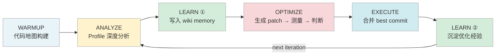
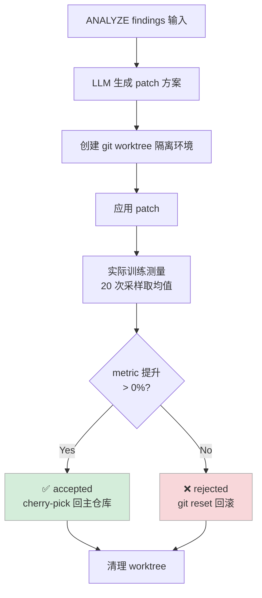
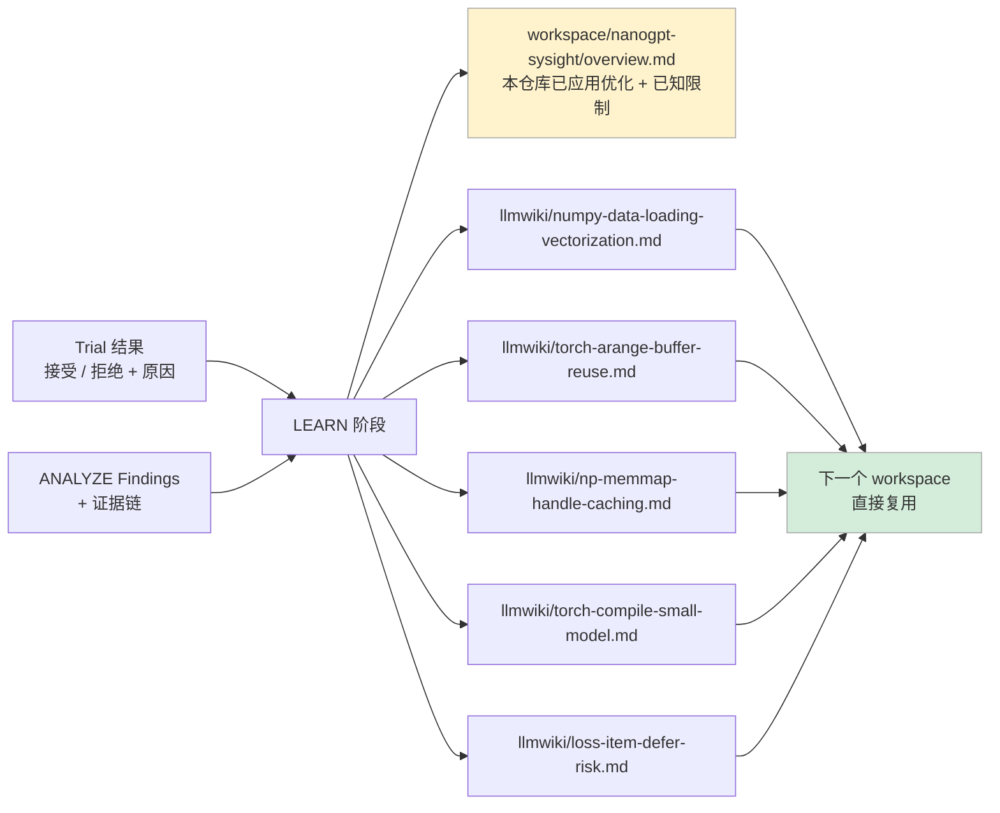

# 用 AI 自动化优化 nanoGPT 训练：一次完整的 Pipeline 实录

**核心结论：** 在 nanoGPT Shakespeare 字符级训练任务上，Sysight 无需人工干预，自动跑完了"profile 分析 → 问题定位 → patch 生成 → 效果验证 → 经验沉淀"的完整闭环，两轮迭代将单步迭代时间从 **14.12ms 压缩到 12.96ms，提升 8.2%**。人的介入只有两处：提供 nsys profile，以及最后读结果。

---

## 目录

- [一、结果](#一结果)
- [二、为什么要做这件事](#二为什么要做这件事)
- [三、Pipeline 是怎么工作的](#三pipeline-是怎么工作的)
- [四、Profile 分析找到了什么问题](#四profile-分析找到了什么问题)
- [五、Iter-1：最优组合 Trial](#五iter-1最优组合-trial)
- [六、Iter-2：两个被拒绝的方向](#六iter-2两个被拒绝的方向)
- [七、经验如何被沉淀](#七经验如何被沉淀)
- [八、遗留问题与下一步](#八遗留问题与下一步)

---

## 一、结果

### 完整 3 个 Trial 一览

| Iter | Trial | 优化策略 | 前 (ms) | 后 (ms) | 变化 | 结果 |
|------|-------|----------|:-------:|:-------:|:----:|:----:|
| iter-1 | trial-001 | 三项 CPU 优化合并（最优组合） | 14.119 | 12.956 | **↓ 8.23%** | ✅ accepted |
| iter-2 | trial-002 | `torch.compile`（独立 patch） | 12.956 | — | patch hash miss | ❌ rejected |
| iter-2 | trial-003 | deferred `loss.item()` sync | 12.956 | 13.652 | ↑ 5.37% | ❌ rejected |

### Trial-001 采样分布对比（20 次采样）

```
Baseline   min=12.72  ─────────────────────────────── max=15.32   mean=14.12ms  range=2.60ms
Optimized  min=12.36  ──────────────────  max=13.28              mean=12.96ms  range=0.92ms
```

抖动从 ±1.3ms 收窄到 ±0.46ms，CPU 端的随机扰动少了 64%。

---

## 二、为什么要做这件事

性能优化有个隐藏成本：profiling 工具和代码之间的跳转。工程师要在"看 profile → 找代码 → 判断真假 → 写 patch → 验证"这个循环里反复切换上下文，每步都很费时间。

Sysight 要解决的问题很直接：给一份 nsys profile，给一个代码仓库，让 AI 自己把这个循环跑完。

这件事有几个卡点不好处理——

- **Profile 数据是 SQLite，有几十张表**，LLM 要懂怎么查、查什么
- **改了代码得实际跑起来量时间**，不然 AI 会自欺欺人
- **改错了要能自动回滚**，不能让仓库进入坏状态
- **多轮迭代之间要有记忆**，不能每次从零开始重复发现同样的问题

选 nanoGPT 作为验证对象：代码干净、问题实际、社区熟悉，Shakespeare 字符级任务小到可以在笔记本上跑，大到 profile 里确实能看到问题。

---

## 三、Pipeline 是怎么工作的

整个流程五个阶段，全自动：



**WARMUP** 扫代码库建地图：入口文件在哪、热路径是什么、最小可运行命令是什么。确定性执行，不调 LLM。

**ANALYZE** 拿 nsys profile 的 SQLite，LLM 自主查询分析。给了一套结构化工具：查 GPU kernel 时序、查 sync event、查 D2H memcpy、查 NVTX range，模型自己决定查什么、怎么解读。一轮分析约 15–20 次工具调用，输出带文件路径和行号的 finding 列表。

**OPTIMIZE** 是核心内循环，每个 trial 走一遍下面这个流程：



**LEARN** 把 trial 结论写入跨 workspace 的 wiki memory，下一轮遇到类似 finding 直接参考，不重复踩坑。

---

## 四、Profile 分析找到了什么问题

ANALYZE 阶段的核心结论：

> **GPU 空转率 91.9%** — trace 里 GPU compute 只占 8.1%，剩下的时间 GPU 在等 CPU

不全是模型小的原因，而是训练循环里三处 CPU 端开销每步都在打断 GPU 节奏。

### 问题一：每个 batch 重新打开 memmap 文件

```python
# train.py — 每次 get_batch 都走这里
def _get_data_memmap(split):
    filename = 'train.bin' if split == 'train' else 'val.bin'
    return np.memmap(os.path.join(data_dir, filename), dtype=np.uint16, mode='r')
```

`np.memmap` 每次调用都要打开文件句柄、建立内存映射。一次 24 步的 warmup 测量就是 **27 次不必要的文件 I/O**。

### 问题二：每次 forward 重新生成 position tensor

```python
# model.py:174 — 每次 forward pass 都执行
pos = torch.arange(0, t, dtype=torch.long, device=device)
```

`t = block_size = 128` 是常量，但每步 forward 都在 GPU 上 launch 一个小 kernel 生成这个 tensor。**每步 = 一次本可避免的 CUDA kernel launch**，每次都打断 GPU pipeline。

### 问题三：逐样本串行的数据类型转换

```python
# train.py — 原始 get_batch
x = torch.stack([torch.from_numpy((data[i:i+block_size]).astype(np.int64)) for i in ix])
y = torch.stack([torch.from_numpy((data[i:i+block_size]).astype(np.int64)) for i in ix])
```

`batch_size=32`，每次 `get_batch` 做 **64 次** `uint16 → int64` 单样本转换，全部 Python 循环，全部串行，全部在主线程上挡着 GPU。

### 问题四：`loss.item()` 同步阻塞

Profile 每步都记录到 `CUPTI_ACTIVITY_SYNCHRONIZATION_TYPE_STREAM_SYNCHRONIZE`，`loss.item()` 强制 CPU 等 GPU 完成当前步才能进下一步 forward。理论上推迟这个调用可以和下一步 forward 重叠——实测结论不支持，原因见第六节。

---

## 五、Iter-1：最优组合 Trial

LLM 在第一轮就直接将三项已分析确认的 CPU 优化合并成一个 trial 一次性提交：

**三处代码修改：**

```python
# 1. 关掉每次重载 memmap（config/sysight_baseline.py）
reload_memmap_each_batch = False

# 2. pos tensor 改为 register_buffer，只初始化一次（model.py __init__）
self.register_buffer('pos', torch.arange(0, config.block_size, dtype=torch.long))

# 3. forward 中直接用 buffer view，0 copy，0 kernel launch（model.py forward）
pos = self.pos[:t]

# 4. get_batch 换成 numpy 高级索引，批量转换（train.py）
x_np = data[ix[:, None] + np.arange(block_size)].astype(np.int64)
x    = torch.from_numpy(x_np)
```

结果是 3 个 trial 里单次提升最大的一次：**14.119ms → 12.956ms，↓ 8.23%**。

采样分布的变化也值得关注：baseline 的 range 是 2.60ms，优化后收窄到 0.92ms。这三处修改不只是让均值降低了，还减少了每步在 CPU 端引入的随机扰动，训练节奏更稳了。

---

## 六、Iter-2：两个被拒绝的方向

Iter-2 探索了两个更激进的优化方向，均被正确拒绝。拒绝得对，比接受得对更难。

### Trial-002：`torch.compile` 在小模型上不划算

Analyzer 发现 profile 里有 **6431 个 CUDA kernel，累计 371ms 的 GPU idle gap**，逻辑上 compile 能把相邻的小 kernel 融合起来，减少 launch overhead。判断没问题。

但 trial 因 patch hash 计算 bug 未能跑起来（目标文件路径指向不存在的 config 文件），被标记为 rejected。

即使跑起来，结论大概率也不通过：MPS 手动测试显示，这个规模的模型（4 层，n_embd=128）开 compile 慢 ~5%。shape 特化和图追踪的开销在小模型上盖过了融合收益。在 GPU-bound 大模型上值得重新测，但不是现在。

### Trial-003：deferred `loss.item()` 在 MPS 上没有 overlap 空间

理论上是正确的：`loss.item()` 触发 D2H 同步，把它挪到下一步 forward 开始后再执行，GPU 应该已经跑完，sync 实际上不阻塞。Analyzer 在 profile 里找到了充分证据。

实测退步 **5.37%**（12.956ms → 13.652ms）。

根本原因：MPS 后端没有真正的异步流，D2H 的 overlap 空间本就不存在，defer 没有收益，反而多了 Python 状态变量维护的开销。这个优化在真实 CUDA 多流环境下值得重新测，MPS 上的结论不能泛化。

---

## 七、经验如何被沉淀

每轮 OPTIMIZE 结束，LEARN 阶段把 trial 结论写入 wiki：



`llmwiki` 里的页面是跨 workspace 的，下一个训练仓库进来，遇到同样的 finding 会直接参考这里的结论，不会重复测 compile 在小模型上有没有用。

LEARN 总结里专门加了一条拒绝注记：

> "Added defer-loss rejection note to overview Sync Points section, and wrote two cross-project experience pages about numpy data loading vectorization and loss.item() defer risks."

---

## 八、遗留问题与下一步

### 已知工程问题

| 问题 | 状态 | 说明 |
|------|:----:|------|
| patch hash 计算 bug（compile trial） | ⚠️ 待修复 | 目标文件路径指向不存在的配置文件，patch 未能应用 |
| `nsys` 不在 PATH（Mac 本地） | ℹ️ 预期行为 | profile refresh 降级复用已有 profile，服务器端正常 |

### 下一步：八卡服务器

这次 Demo 的局限很清楚：

- nanoGPT 代码干净规模小，真实训练仓库复杂得多
- MPS 上 `torch.compile` 和 deferred sync 的结论**不能直接泛化到 CUDA 多流环境**
- 8.2% 的提升来自 CPU-bound 小模型，在 GPU-bound 大模型上优化方向会完全不同

在八卡 A100/H100 上的实验目标：

1. 验证 deferred `loss.item()` 在真实 CUDA 多流下是否有 overlap 收益
2. 验证 `torch.compile` 在 GPU-bound 模型上的 kernel 融合效果
3. 测量包含 NCCL all-reduce 的分布式 profile 上，ANALYZE 的 finding 质量
4. 测量端到端 pipeline 在更大代码库上的稳定性

---

整个过程大约跑了 1.5 小时，两轮 ANALYZE 的多轮 LLM 调用和三次测量。3 个 trial 里 AI 自己决定接受了 1 个、拒绝了 2 个，拒绝的理由在事后回看都站得住脚。"知道什么不值得做"这件事，比"提出优化想法"更难，也更重要。
