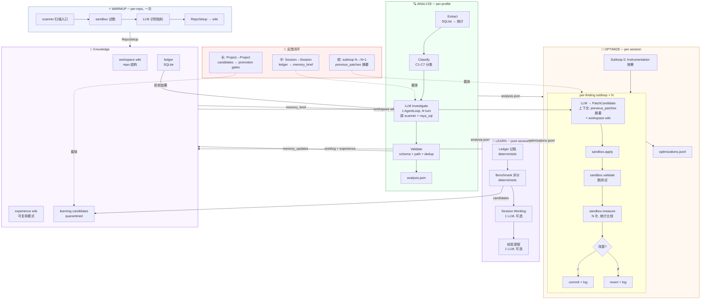
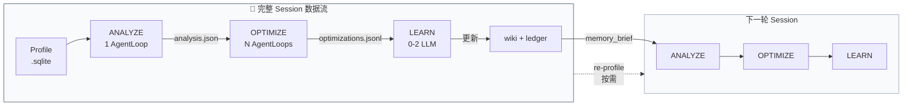

# Sysight Blueprint v4 — Stage-Driven Implementation

Date: 2026-04-30
Status: complete architecture + shared components + test strategy

---

## 系统 Workflow





## 项目文件树

```
sysight/
  contracts/                     # 阶段 1: 共享 dataclass, 无依赖
    evidence.py                  # ProfileEvidence, BottleneckReport, EvidenceWindow
    findings.py                  # LocalizedFinding, LocalizedFindingSet, MemoryUpdate
    optimization.py              # PatchCandidate, PatchResult, ExecutionConfig
    repo_setup.py               # RepoSetup
    memory.py                    # MemoryPage, MemoryBrief

  tools/                         # 阶段 2: 纯函数 + ToolDef, 依赖 contracts
    registry.py                  # ToolRegistry, ToolDef, ToolPolicy, ToolResult
    scanner/
      __init__.py                # register_scanner_tools()
      files.py                   # ToolDef("scanner.files") + files()
      search.py                  # ToolDef("scanner.search") + search()
      read.py                    # ToolDef("scanner.read") + read()
      symbols.py                 # ToolDef("scanner.symbols") + symbols()
      callers.py                 # ToolDef("scanner.callers") + callers()
      callees.py                 # ToolDef("scanner.callees") + callees()
      trace.py                   # ToolDef("scanner.trace") + trace()
      variants.py                # ToolDef("scanner.variants") + variants()
    nsys_sql/
      __init__.py                # register_nsys_sql_tools()
      kernels.py                 # ToolDef("nsys_sql.kernels") + kernels()
      sync.py                    # ToolDef("nsys_sql.sync") + sync()
      memcpy.py                  # ToolDef("nsys_sql.memcpy") + memcpy()
      nccl.py                    # ToolDef("nsys_sql.nccl") + nccl()
      overlap.py                 # ToolDef("nsys_sql.overlap") + overlap()
      gaps.py                    # ToolDef("nsys_sql.gaps") + gaps()
      launch.py                  # ToolDef("nsys_sql.launch") + launch()
    sandbox/
      __init__.py                # register_sandbox_tools()
      exec.py                    # ToolDef("sandbox.exec") + exec()
      measure.py                 # ToolDef("sandbox.measure") + measure()
      apply.py                   # ToolDef("sandbox.apply") + apply()
      validate.py                # ToolDef("sandbox.validate") + validate()
      commit.py                  # ToolDef("sandbox.commit") + commit()
      revert.py                  # ToolDef("sandbox.revert") + revert()
      create.py                  # ToolDef("sandbox.create") + create()
      destroy.py                 # ToolDef("sandbox.destroy") + destroy()
    memory/
      __init__.py                # register_memory_tools()
      search.py                  # ToolDef("memory.search") + search()
      read.py                    # ToolDef("memory.read") + read()
      write.py                   # NOT a tool: parent-only write()
    classify.py                  # ToolDef("classify") + classify()

  knowledge/                     # 阶段 3: 存储管理, 依赖 contracts + tools/memory/write
    store.py                     # wiki page CRUD (YAML frontmatter)
    index.py                     # SQLite FTS 索引
    brief.py                     # build_memory_brief()
    ledger.py                    # SQLite run tracking
    promotion.py                 # LearningCandidate → gated promotion
    skills.py                    # skill registry

  agent/                         # 阶段 4: LLM 抽象, 依赖 tools + contracts
    provider.py                  # LLMProvider 协议 + LLMConfig/LLMRequest/LLMResponse
    providers/
      openai.py                  # OpenAIProvider
      anthropic.py               # AnthropicProvider
      deepseek.py                # DeepSeekProvider (OpenAI-compatible)
      replay.py                  # ReplayProvider (测试用)
    loop.py                      # AgentLoop: tool-calling 循环
    prompts/
      loader.py                  # PromptLoader: 组装 fragments
      fragments/
        common_role.md
        evidence_sop.md
        optimizer_sop.md
        output_schema_localized.md
        output_schema_patch.md
        safety_read_only.md
        benchmark_hints.md

  pipeline/                      # 阶段 5-8: 阶段编排, 依赖以上所有
    warmup.py                    # 阶段 5: WARMUP
    analyze.py                   # 阶段 6: ANALYZE
    optimize.py                  # 阶段 7: OPTIMIZE
    learn.py                     # 阶段 8: LEARN
    runner.py                    # PipelineRunner: session 编排

  shared/                        # 内部工具, 无业务依赖
    security.py                  # 路径包含检查, sandbox 策略
    repo.py                      # git helpers (commit hash, worktree)

  integration/                   # 阶段 9: CLI + MCP
    cli.py                       # warmup / analyze / optimize / learn / full / tool
    mcp_server.py                # MCP 适配 (future)

test/
  test_contracts/                # 阶段 1: dataclass 序列化/反序列化
  test_tools/                    # 阶段 2: 每个 tool 独立测试
    test_scanner.py              # 用 temp repo
    test_nsys_sql.py             # 用 synthetic SQLite
    test_sandbox.py              # 用 temp git repo
    test_memory_tools.py         # 用 temp dir
    test_registry.py             # ToolRegistry 注册/执行/策略
    test_classify.py             # 用 synthetic profile
  test_knowledge/                # 阶段 3
    test_store.py                # wiki CRUD + frontmatter
    test_index.py                # FTS 搜索
    test_brief.py                # memory_brief 生成
    test_ledger.py               # SQLite 记录/查询
    test_promotion.py            # gated promotion
  test_agent/                    # 阶段 4
    test_provider.py             # Provider 协议 + ReplayProvider
    test_loop.py                 # AgentLoop: tool-calling / stop conditions
  test_pipeline/                 # 阶段 5-8
    test_warmup.py               # WARMUP flow (use ReplayProvider)
    test_analyze.py              # ANALYZE flow (use ReplayProvider)
    test_optimize.py             # OPTIMIZE flow (use ReplayProvider + temp git)
    test_learn.py                # LEARN flow
  test_integration/              # 阶段 9
    test_cli.py                  # CLI 命令集成测试

.sysight/
  memory/
    wiki/
      workspaces/<ns>/           # overview.md, worklog.md, repo_setup.md
      experiences/<slug>.md      # YAML frontmatter + markdown body
      signals/C1.md ... C7.md   # 按类别反链经验
      INDEX.md                   # 自动生成
    active.md                    # memory_brief 快照
    raw/runs/<run_id>/           # 原始 artifacts (prompts, stdout, stderr)
  runs/
    runs.sqlite                  # ledger
  skills/<name>/                 # SKILL.md + manifest.json
```

---

## 1. 总览

### 1.1 四个组件

```
WARMUP (per-repo, 1 LLM)  →  RepoSetup → workspace wiki
ANALYZE (per-profile, 1 AgentLoop)  →  LocalizedFindingSet
OPTIMIZE (per-session, N AgentLoops)  →  optimizations.jsonl
LEARN (post-session, 0-2 LLM)  →  ledger + experience wiki
```

| 组件 | 做什么 | 写? | LLM |
|---|---|---|---|
| analyzer | profile → extract+classify → LLM 定位 → findings | 只读 | 1 AgentLoop |
| optimizer | per-finding: LLM → patch → sandbox → keep/revert | patch 文本 | N AgentLoops |
| executor | sandbox 生命周期, 命令执行, 指标测量 | 沙箱内 | 否 |
| knowledge | wiki + ledger + brief + promotion | gated | 可选 |

### 1.2 核心原则

- **AgentLoop.run() 之间无对话历史继承** — 上下文通过结构化 artifact 传递
- **工具共享** — `sysight/tools/` 下所有阶段共用同一套工具
- **Phase 边界安全** — ANALYZE 只读, OPTIMIZE 沙箱内写, 不碰用户工作树
- **benchmark 不自动变异 prompt** — 所有 benchmark miss → quarantined candidate
- **每个阶段可独立运行可独立测试** — debug 时只跑一个阶段

### 1.3 LLM 调用预算

| 阶段 | LLM 调用 | 模型 tier |
|---|---|---|
| WARMUP | 1 AgentLoop | light (gpt-5.4-mini) |
| ANALYZE | 1 AgentLoop (多 turn) | heavy (gpt-5.4 / claude-opus) |
| OPTIMIZE | N AgentLoops (每 finding 1 次) | medium (claude-sonnet) |
| LEARN | 0-2 | light |

### 1.4 依赖方向

```
contracts/  ← 无依赖
    ↑
tools/  ← contracts/
    ↑
knowledge/  ← contracts/ + tools/memory/write
    ↑
agent/  ← tools/ + contracts/
    ↑
pipeline/  ← 以上所有
    ↑
integration/  ← pipeline/
```

---

## 2. Contracts

**目标**: 所有模块共享的数据类型定义。纯 dataclass，无行为。

### 2.1 产出文件

```
sysight/contracts/
  evidence.py       ProfileEvidence, BottleneckReport, EvidenceWindow, GpuDeviceInfo
  findings.py       LocalizedFinding, LocalizedFindingSet, MemoryUpdate
  optimization.py   PatchCandidate, PatchResult, ExecutionConfig
  repo_setup.py     RepoSetup
  memory.py         MemoryPage, MemoryBrief
```

### 2.2 核心类型

```python
# findings.py
@dataclass
class LocalizedFinding:
    finding_id: str                      # "{category}:{file}:{line}:{function}"
    category: str                        # C1-C7
    title: str
    priority: Literal["high", "medium", "low"]
    confidence: Literal["confirmed", "probable", "unresolved"]
    evidence_refs: list[str]
    file_path: str | None
    function: str | None
    line: int | None
    description: str
    suggestion: str
    status: Literal["accepted", "rejected", "unresolved"] = "accepted"
    reject_reason: str = ""

@dataclass
class LocalizedFindingSet:
    run_id: str
    summary: str
    findings: list[LocalizedFinding]
    rejected: list[LocalizedFinding]
    memory_updates: list[MemoryUpdate]
    parse_error: str = ""

# optimization.py
@dataclass
class PatchCandidate:
    patch_id: str
    finding_id: str
    file_path: str
    old_span_start: int
    old_span_end: int
    old_span_hash: str
    replacement: str
    rationale: str
    validation_commands: list[list[str]]

@dataclass
class PatchResult:
    patch_id: str
    finding_id: str
    status: Literal["kept", "reverted"]
    reason: str     # "" | "apply_failed" | "tests_failed" | "metric_regression" | "metric_unchanged"
    metric_before: float | None
    metric_after: float | None
    delta_pct: float | None

# repo_setup.py
@dataclass
class RepoSetup:
    entry_point: str
    minimal_run: list[str]
    metric_grep: str | None
    metric_lower_is_better: bool
    needs_instrumentation: bool
    test_commands: list[list[str]]
    build_commands: list[list[str]]
    env_vars: dict[str, str]
    constraints: list[str]
    source: Literal["warmup_verified", "warmup_partial", "manual", "benchmark_case"]
    verified_at: str
```

### 2.3 Test 要求

```
test/test_contracts/
  test_findings.py      LocalizedFindingSet 序列化/反序列化, finding_id 生成规则
  test_optimization.py  PatchCandidate 字段验证, old_span_hash 计算
  test_repo_setup.py    ExecutionConfig 默认值, source 枚举
```

---

## 3. Tools

**目标**: 所有 LLM 可调用的工具。纯函数 + typed I/O + JSON Schema + ToolRegistry 注册。

### 3.1 Tool 标准形态

```python
# sysight/tools/scanner/search.py
from dataclasses import dataclass
from ..registry import ToolDef

@dataclass
class SearchResult:
    matches: list[SearchMatch]
    total_files: int
    total_matches: int

def search(repo: str, query: str, ext: str = "py", fixed: bool = False) -> SearchResult:
    """Pure function. No side effects, no global state."""
    ...

SEARCH_TOOL = ToolDef(
    name="scanner.search",
    description="Full-text search in repo source files",
    parameters={
        "type": "object",
        "properties": {
            "repo":  {"type": "string", "description": "Path to repo root"},
            "query": {"type": "string", "description": "Search term or regex"},
            "ext":   {"type": "string", "default": "py"},
            "fixed": {"type": "boolean", "default": False},
        },
        "required": ["repo", "query"],
    },
    fn=search,
    read_only=True,
)
```

### 3.2 ToolRegistry

```python
@dataclass
class ToolDef:
    name: str
    description: str
    parameters: dict          # JSON Schema
    fn: Callable
    read_only: bool = True
    max_calls_per_task: int = 50

@dataclass
class ToolPolicy:
    allowed_tools: set[str]
    read_only: bool = True
    max_calls_per_task: int = 50
    max_wall_seconds: int = 600
    path_containment: dict[str, str]

class ToolRegistry:
    def register(self, tool: ToolDef) -> None: ...
    def execute(self, name: str, args: dict, policy: ToolPolicy) -> ToolResult: ...
    def list_read_only(self) -> list[ToolDef]: ...
    def as_openai_tools(self) -> list[dict]: ...
    def as_anthropic_tools(self) -> list[dict]: ...
```

### 3.3 工具清单

| 类别 | 工具 | 只读 |
|---|---|---|
| scanner | files, search, read, symbols, callers, callees, trace, variants | ✓ |
| nsys_sql | kernels, sync, memcpy, nccl, overlap, gaps, launch | ✓ |
| sandbox | exec, measure, apply, validate, commit, revert, create, destroy | ✗ |
| memory | search, read | ✓ |
| classify | classify | ✓ |

### 3.4 Tool Policy per Phase

| Phase | allowed_tools | read_only |
|---|---|---|
| WARMUP | scanner.* + sandbox.exec + sandbox.check_available | false |
| ANALYZE | scanner.* + nsys_sql.* + memory.search/read + classify | true |
| OPTIMIZE | scanner.* + sandbox.apply/validate/measure/commit/revert | false |
| LEARN | memory.* | true |

### 3.5 Test 要求

```
test/test_tools/
  test_scanner.py      每个 scanner tool 用 temp repo 测试:
                       - files: 文件过滤正确
                       - search: 匹配准确, 行号正确
                       - read: 起止行正确, 路径越界被拒绝
                       - symbols: 函数/类提取正确
                       - callers: 调用者发现正确
  test_nsys_sql.py     用 synthetic SQLite 测试
  test_sandbox.py      用 temp git repo 测试:
                       - create/destroy 正确
                       - apply/validate/measure 流程
                       - revert 后代码库恢复
  test_memory_tools.py 用 temp dir 测试 search/read
  test_registry.py     ToolRegistry 注册/执行/策略拒绝
  test_classify.py     用 synthetic profile 测试 C1-C7 分类
```

---

## 4. Knowledge

**目标**: wiki 存储 + FTS 搜索 + memory_brief + ledger + promotion。父进程管理，子 agent 不可直接写。

### 4.1 Wiki 存储格式

YAML frontmatter + markdown body：

```markdown
---
title: D2H 隐式同步检测
category: C3
tags: [d2h, sync, item, cpu]
scope: global
source_run: run-20260430-001
created: 2026-04-30T15:42:00
---

## 触发条件
- D2H count 与 step 数对齐, bytes 很小

## 解决方案
检查 .item() / .cpu() / .numpy(), 累积批量处理
```

### 4.2 存储层 API

```python
# sysight/knowledge/store.py
def read_page(path: str, namespace: str | None = None) -> MemoryPage | None: ...
def write_page(page: MemoryPage) -> None: ...            # parent only
def append_worklog(namespace: str, entry: str) -> None: ...
def list_experiences(category: str | None = None) -> list[MemoryPage]: ...

# sysight/knowledge/index.py
def search_fts(query: str, namespace: str | None = None, limit: int = 10) -> list[SearchResult]: ...
def rebuild_index() -> None: ...

# sysight/knowledge/brief.py
def build_memory_brief(namespace: str | None = None) -> str: ...
# ≤200 lines: workspace overview + top 3 experiences + recent session outcome

# sysight/knowledge/ledger.py
def init_ledger() -> None: ...
def record_session(run: dict) -> None: ...
def record_findings(run_id: str, findings: list[LocalizedFinding]) -> None: ...
def record_patches(run_id: str, patches: list[PatchResult]) -> None: ...
def record_benchmark(run_id: str, case: str, score: dict) -> None: ...
def record_candidate(c: LearningCandidate) -> None: ...
def recent_session(namespace: str) -> dict | None: ...

# sysight/knowledge/promotion.py
def validate_candidate(c: LearningCandidate) -> tuple[bool, list[str]]: ...
def promote(c: LearningCandidate, reviewer: str) -> PromotionRecord: ...
```

### 4.3 Test 要求

```
test/test_knowledge/
  test_store.py       wiki page CRUD, frontmatter 解析, namespace 隔离
  test_index.py       FTS 搜索准确, 中文分词
  test_brief.py       ≤200 lines, 不包含 benchmark notes
  test_ledger.py      SQLite schema, idempotent write, SOTA 查询
  test_promotion.py   candidate 验证, benchmark scope 不能 promote global
```

---

## 5. Agent

**目标**: LLM provider 抽象 + AgentLoop。所有 LLM 调用通过这一层。

### 5.1 Provider 协议

```python
@dataclass
class LLMConfig:
    provider: str              # "openai" | "anthropic" | "deepseek"
    model: str
    api_key: str | None        # None → env var
    base_url: str | None
    temperature: float = 0
    max_tokens: int = 4096

class LLMProvider(Protocol):
    @property
    def name(self) -> str: ...
    def complete(self, request: LLMRequest) -> LLMResponse: ...

@dataclass
class LLMRequest:
    system_prompt: str
    messages: list[dict]
    tools: list[dict] | None
    response_schema: dict | None

@dataclass
class LLMResponse:
    content: str
    structured_output: dict | None
    tool_calls: list[ToolCallRequest]
    usage: UsageInfo
    finish_reason: str
```

### 5.2 AgentLoop

```python
class AgentLoop:
    """一次 run() = 一个独立 LLM 多轮 tool-calling 会话。
       run() 之间无对话历史继承。"""

    def run(self, task: AgentTask, policy: ToolPolicy) -> AgentResult:
        # 1. system + user prompt → LLM
        # 2. LLM returns tool calls → execute via ToolRegistry → feed back
        # 3. LLM returns structured_output → validate → return
        # Stop: max_turns, max_time, repeated_calls, policy_violation
```

### 5.3 Test 要求

```
test/test_agent/
  test_provider.py    ReplayProvider 返回 fixture, 不调真实 API
  test_loop.py        tool-calling 循环正确, stop condition 触发
```

---

## 6. WARMUP

**目标**: 一次 repo 探索 → RepoSetup 写入 workspace wiki。同一个 repo 只跑一次。

### 6.1 Flow

```
1. 扫描入口候选
   scanner.files → train.py, run.sh, pyproject.toml
   scanner.search "if __name__" → 入口点

2. 试跑验证
   sandbox.exec(["python3", "train.py", "--help"], timeout=15)
   sandbox.exec(["python3", "train.py", "--steps", "1", "--batch-size", "2"], timeout=60)
   → stdout: "iter/s: 145.2 | loss: 0.234"
   → LLM 识别指标
   失败 → 调整, 最多 3 轮

3. 测试发现
   scanner.search "pytest|unittest"
   sandbox.exec(["python3", "-m", "pytest", "--collect-only"], timeout=15)

4. 汇总 → workspace wiki (repo_setup.md)
```

### 6.2 CLI

```bash
sysight warmup ./my-repo
sysight warmup ./my-repo --force
```

### 6.3 Test 要求

```
test/test_pipeline/test_warmup.py
  - 用 temp repo (含 train.py + config) + ReplayProvider
  - RepoSetup 产出正确
  - repo_setup.md 写入 wiki
  - --force 覆盖已有
```

---

## 7. ANALYZE

**目标**: 1 次 AgentLoop → LocalizedFindingSet。profile evidence → 源码定位。

### 7.1 Flow

```
1. Extract (确定性)
   SQLite → kernels/sync/memcpy/nvtx/gaps/nccl/overlap/launch/cpu_samples
   大 SQL 结果存 artifact refs

2. Classify (确定性)
   逐类 C1-C7 → BottleneckReport

3. Build Prompt
   system: role + evidence_sop + output_schema + safety
   user: profile_summary + bottleneck_table + pre_injected_sql + memory_brief

4. LLM Investigate (1 AgentLoop, N turn)
   C1,C7 → C2,C5 → C3,C4 → C6
   每类: 假设 → tool call → 验证 → finding
   顺手: repo 结构 → memory_updates

5. Validate (确定性)
   category valid, path contained, file/line exist, evidence refs ok, dedup
   → accepted / rejected

6. Apply Memory (确定性)
   memory_updates → workspace/experience wiki (parent writes)
```

### 7.2 Output

`.sysight/runs/<run_id>/analysis.json`

### 7.3 CLI

```bash
sysight analyze trace.sqlite --repo ./my-repo
sysight analyze trace.sqlite --repo ./my-repo --llm-provider anthropic
```

### 7.4 Test 要求

```
test/test_pipeline/test_analyze.py
  - 用 synthetic SQLite + temp repo + ReplayProvider
  - Extract+Classify 产出正确 EvidenceBundle
  - LLM findings 正确 parse 为 LocalizedFindingSet
  - path 越界 finding 被 reject
  - memory_updates 被 apply
  - parse_error 不为空时 status=error
```

---

## 8. OPTIMIZE

**目标**: N 次 AgentLoop → optimizations.jsonl。per-finding: LLM 生成 patch → sandbox 执行 → keep/revert。

### 8.1 ExecutionConfig 获取

优先级: CLI > case.yaml > workspace wiki > LLM 推断

### 8.2 Flow

```
Subloop 0: Instrumentation (按需, 1 LLM)
  条件: ExecutionConfig.needs_instrumentation
  LLM → patch_instrument → apply → validate → exec 确认 → commit

Subloop 1..N: Per-Finding
  findings 按 priority > confidence > category_weight 排序

  for each finding:
    ┌─ LLM (1 AgentLoop) → PatchCandidate
    │   输入: finding + 当前源码 + previous_patches 摘要 + workspace wiki
    │   上下文: 上一个 subloop 的 patch 结果 (结构化摘要, 非对话历史)
    └─────────────────────────────────────────────────

    ┌─ Sandbox
    │   apply → validate → measure(N repeats) → decide
    │   → kept:   commit + log
    │   → failed: revert + log (reason: apply_failed|tests_failed|metric_regression|metric_unchanged)
    └─────────────────────────────────────────────────

    → 写入 optimizations.jsonl (追加)
```

### 8.3 Output

`.sysight/runs/<run_id>/optimizations.jsonl` (追加)

### 8.4 CLI

```bash
sysight optimize analysis.json --repo ./my-repo
sysight optimize analysis.json --repo ./my-repo --run-cmd "python train.py --steps 10" --metric "iter/s"
```

### 8.5 Test 要求

```
test/test_pipeline/test_optimize.py
  - 用 temp git repo + ReplayProvider (fixture: PatchCandidate)
  - sandbox apply → validate → measure → keep/revert 流程正确
  - apply_failed → revert
  - tests_failed → revert  
  - metric_unchanged → revert
  - metric_regression → revert
  - previous_patches 摘要传递正确
  - optimizations.jsonl 每行格式正确
  - 不在用户 worktree 执行
```

---

### 8.6 伏笔: nsys-profiled measure

当前 `sandbox.measure(run_cmd, grep, runs)` 只抓取应用层指标（`iter/s` 等）。后续可扩展为套 nsys 启动——measure 过程产出 `.sqlite` profile，OPTIMIZE 可分析 patch 中 NVTX marker 对应的 GPU 时间线，比单纯指标值反馈更丰富。

接口预留:

```python
sandbox.measure(
    run_cmd=["python", "train.py"],
    grep="iter/s",
    runs=5,
    profile="nsys",         # future: 套 nsys 启动 → 产出 .sqlite
    nvtx_markers=True,      # future: 自动关联 patch 中的 NVTX label
)
```

当前不实现，不影响主流程。

---

## 9. LEARN

**目标**: post-session 记账 + 评分 + 工作记录 + 经验提炼。最多 2 次轻量 LLM。

### 9.1 Flow

```
1. Ledger 记账 (确定性)
   runs + findings + patches → SQLite

2. Benchmark 评分 (确定性, truth 存在时)
   score findings against truth → missed → scope="benchmark" candidates

3. Session Worklog (1 LLM, --no-summary 跳过)
   → workspace wiki worklog.md 追加

4. 经验提取 (1 LLM, --no-experience 跳过)
   从 successful patches 提取通用模式 → experience wiki
   parent 验证: dedup + 通用性 + 安全
```

### 9.2 CLI

```bash
sysight learn run-20260430-001
sysight learn run-20260430-001 --no-summary --no-experience
sysight learn run-20260430-001 --benchmark nsys-bench/tests/findings/case_1_findings.json
```

### 9.3 Test 要求

```
test/test_pipeline/test_learn.py
  - ledger 记录正确
  - benchmark scoring 正确
  - missed → candidate (scope="benchmark", status="new")
  - experience dedup 正确
  - benchmark scope 不能 promote global
```

---

## 10. Integration

**目标**: CLI 命令 + MCP server。

### 10.1 CLI

```bash
sysight warmup   ./repo
sysight analyze  trace.sqlite --repo ./repo
sysight optimize analysis.json --repo ./repo
sysight learn    run-<id>
sysight full     trace.sqlite --repo ./repo    # warmup(if needed) → analyze → optimize → learn

# Tool access (for external agent use)
sysight tool scanner search ./repo ".item()"
sysight tool nsys-sql kernels trace.sqlite
sysight tool memory search "D2H pattern"
```

### 10.2 Test 要求

```
test/test_integration/
  test_cli.py     CLI 命令端到端 (用 temp repo + ReplayProvider)
```

---

## 11. 反馈闭环

### 短反馈（OPTIMIZE 内部）
```
subloop #2 reverted (tests_failed)
→ subloop #3 LLM 从 previous_patches 读到: "monitor.py 改动破坏测试"
```

### 中反馈（跨 Session）
```
Session N: finding_B patch reverted → ledger
Session N+1: memory_brief 包含 "上轮 finding_B patch 失败" → LLM 更谨慎
```

### 长反馈（跨项目）
```
多次 benchmark miss → LearningCandidate(scope="benchmark") 积累
→ 人工 review → 改写为 general rule → promotion → experience wiki / detector
```

---

## 12. 实现顺序

```
阶段 1: Contracts     → mkdir contracts/ → dataclasses
阶段 2: Tools         → mkdir tools/     → 每个 tool + ToolRegistry
阶段 3: Knowledge     → mkdir knowledge/ → store + index + brief + ledger
阶段 4: Agent         → mkdir agent/     → provider + loop + prompts
阶段 5: WARMUP        → pipeline/warmup.py
阶段 6: ANALYZE       → pipeline/analyze.py
阶段 7: OPTIMIZE      → pipeline/optimize.py
阶段 8: LEARN         → pipeline/learn.py
阶段 9: Integration   → integration/cli.py
```

每个阶段的 test 与该阶段同步完成。后一阶段依赖前一阶段的 test 通过。
